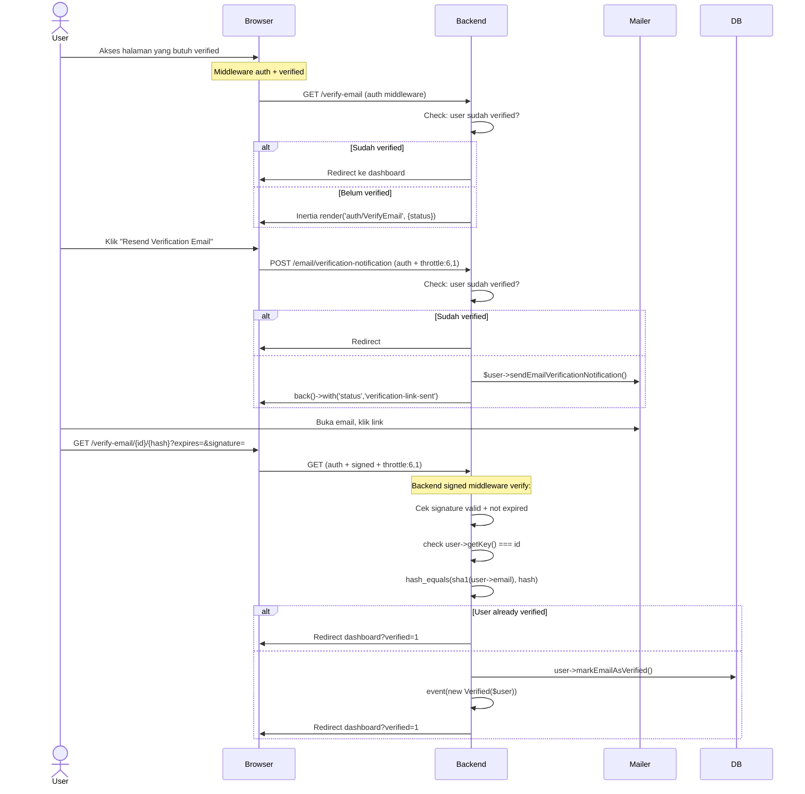

# Email Verification

Verifikasi alamat email pengguna setelah registrasi. Menggunakan signed URL untuk keamanan.

## Flow

## Validasi

**Signed route:** URL harus ditandatangani secara kriptografis (`URL::signedRoute()`) dengan parameter `id`, `hash`, `expires`, `signature`.

Laravel memverifikasi:
1. **Signature valid** — menggunakan APP_KEY
2. **Not expired** — expires timestamp
3. **id matches** — `user->getKey() === $id`
4. **hash matches** — `hash_equals(sha1($user->getEmailForVerification()), $hash)`

## Routes

| Method | URI | Controller | Middleware | Name |
|--------|-----|------------|------------|------|
| GET | `/verify-email` | `EmailVerificationPromptController` | `auth` | `verification.notice` |
| GET | `/verify-email/{id}/{hash}` | `VerifyEmailController` | `auth`, `signed`, `throttle:6,1` | `verification.verify` |
| POST | `/email/verification-notification` | `EmailVerificationNotificationController@store` | `auth`, `throttle:6,1` | `verification.send` |

## Frontend

| File | Purpose |
|------|---------|
| `pages/auth/VerifyEmail.vue` | Prompt + resend button + status message |
