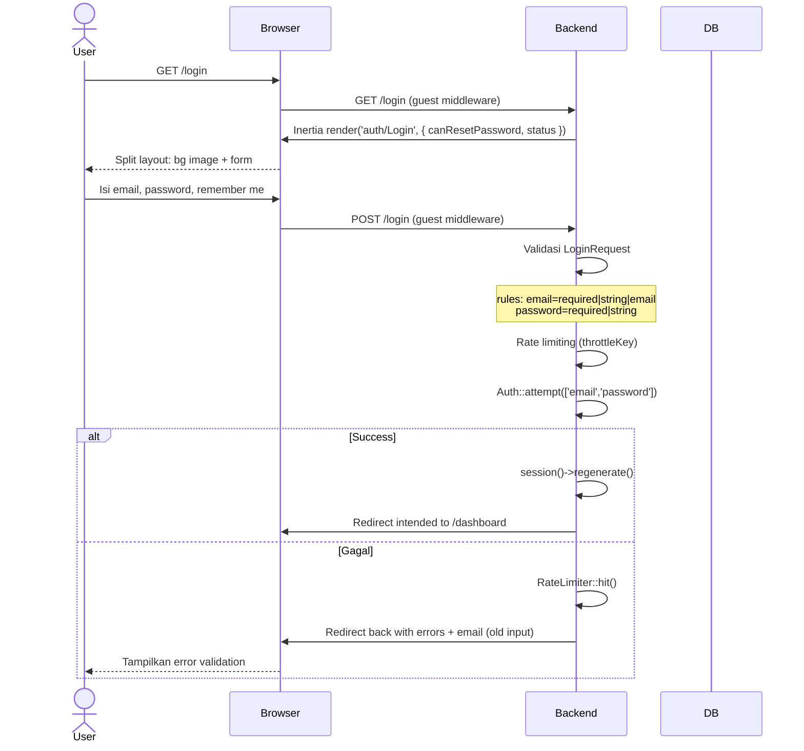
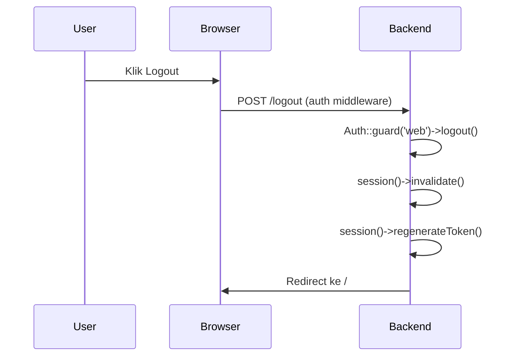

# Login

Halaman login menggunakan layout dua kolom: kiri (background image + gradient overlay + logo) dan kanan (form).

## Flow Backend

## Logout

## Validasi (LoginRequest)

| Field | Rule |
|-------|------|
| `email` | required, string, email |
| `password` | required, string |

## Frontend (Login.vue)

**Teknologi:** Inertia `useForm`, PrimeVue (InputText, Password with toggleMask, Checkbox, Button)

**Perilaku:**
- `form.post(route('login'))`, pada `onFinish` reset password field
- `remember` field dikirim sebagai boolean
- `canResetPassword` diambil dari `Route::has('password.request')`

## Routes

| Method | URI | Controller | Middleware | Name |
|--------|-----|------------|------------|------|
| GET | `/login` | `AuthenticatedSessionController@create` | `guest` | `login` |
| POST | `/login` | `AuthenticatedSessionController@store` | `guest` | — |
| POST | `/logout` | `AuthenticatedSessionController@destroy` | `auth` | `logout` |
