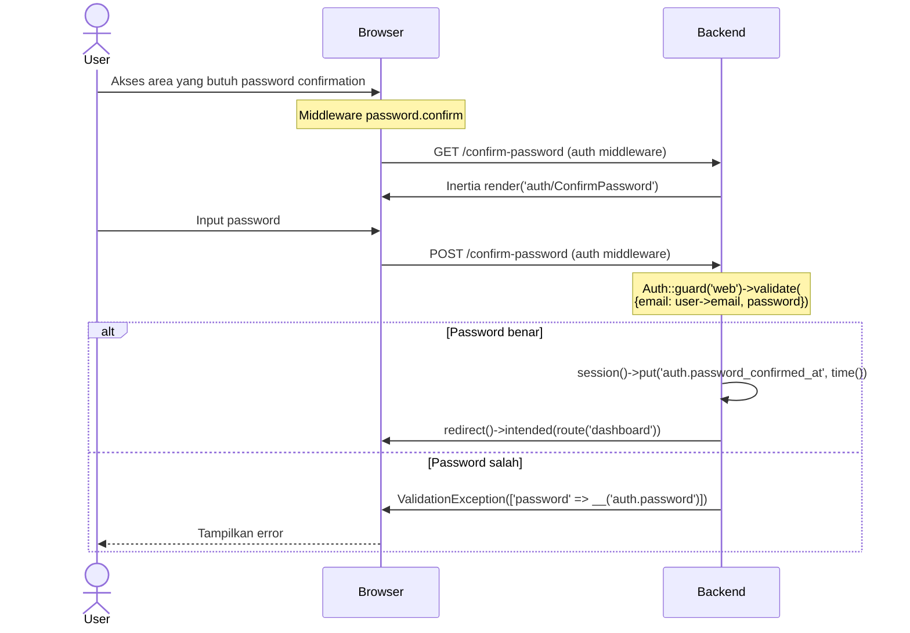

# Password Confirmation

Konfirmasi password untuk mengakses area sensitif aplikasi.

## Flow



## Validasi

Tidak ada FormRequest atau rule `current_password`. Controller memvalidasi password secara manual:

```php
Auth::guard('web')->validate([
    'email' => $request->user()->email,
    'password' => $request->password,
]);
```

Jika gagal, dilempar `ValidationException` dengan pesan `__('auth.password')` pada field `password`.

## Session

Setelah konfirmasi sukses, `auth.password_confirmed_at` disimpan di session. Middleware `password.confirm` akan mengecek session ini untuk mengizinkan akses. Default timeout: 3 jam (10800 detik).

## Routes

| Method | URI | Controller | Middleware | Name |
|--------|-----|------------|------------|------|
| GET | `/confirm-password` | `ConfirmablePasswordController@show` | `auth` | `password.confirm` |
| POST | `/confirm-password` | `ConfirmablePasswordController@store` | `auth` | — |
