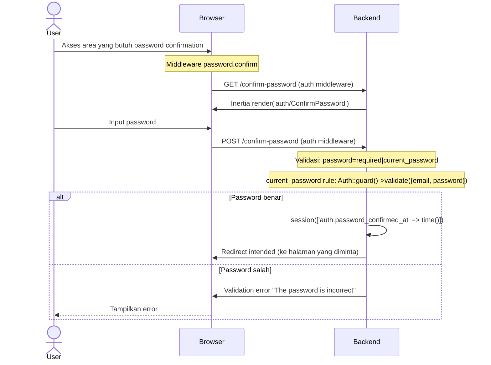

# Password Confirmation

Konfirmasi password untuk mengakses area sensitif aplikasi.

## Flow

## Validasi

| Field | Rule |
|-------|------|
| `password` | required, current_password |

**`current_password` rule:** memvalidasi password terhadap user yang sedang login via `Auth::guard()->validate()`.

## Session

Setelah konfirmasi sukses, `auth.password_confirmed_at` disimpan di session. Middleware `password.confirm` akan mengecek session ini untuk mengizinkan akses. Default timeout: 3 jam (10800 detik).

## Routes

| Method | URI | Controller | Middleware | Name |
|--------|-----|------------|------------|------|
| GET | `/confirm-password` | `ConfirmablePasswordController@show` | `auth` | `password.confirm` |
| POST | `/confirm-password` | `ConfirmablePasswordController@store` | `auth` | — |
