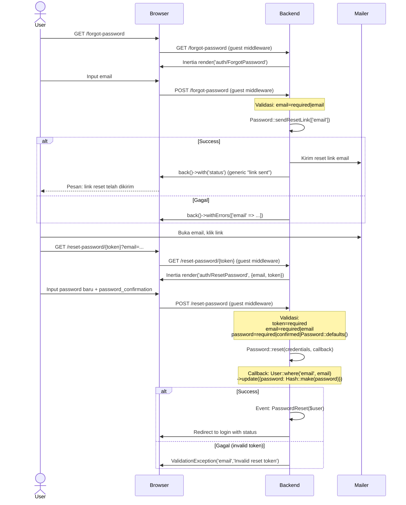

# Password Reset

Flow reset password menggunakan token yang dikirim via email.

## Flow

## Validasi

### Forgot Password

| Field | Rule |
|-------|------|
| `email` | required, email |

### Reset Password

| Field | Rule |
|-------|------|
| `token` | required |
| `email` | required, email |
| `password` | required, confirmed, Password::defaults() |

## Routes

| Method | URI | Controller | Middleware | Name |
|--------|-----|------------|------------|------|
| GET | `/forgot-password` | `PasswordResetLinkController@create` | `guest` | `password.request` |
| POST | `/forgot-password` | `PasswordResetLinkController@store` | `guest` | `password.email` |
| GET | `/reset-password/{token}` | `NewPasswordController@create` | `guest` | `password.reset` |
| POST | `/reset-password` | `NewPasswordController@store` | `guest` | `password.store` |

## Frontend

| File | Purpose |
|------|---------|
| `pages/auth/ForgotPassword.vue` | Email input form |
| `pages/auth/ResetPassword.vue` | Password + confirm + token hidden input |
