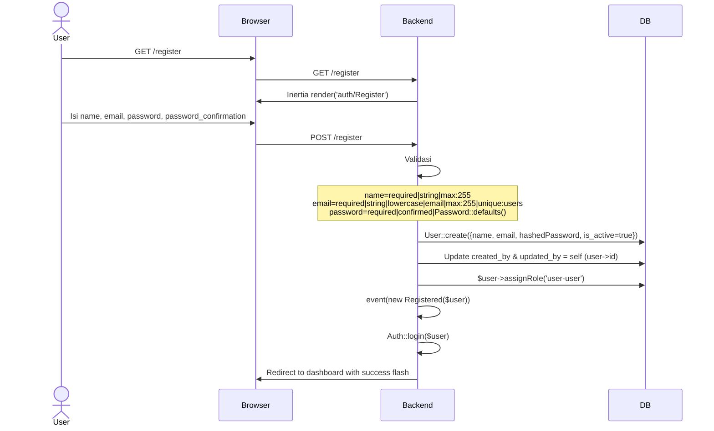

# Register

Pendaftaran pengguna baru. **Routes saat ini dinonaktifkan** (di-comment di `routes/auth.php` lines 15-18).

## Flow Backend

## Validasi

| Field | Rule |
|-------|------|
| `name` | required, string, max:255 |
| `email` | required, string, lowercase, email, max:255, unique:users |
| `password` | required, confirmed, Password::defaults() |

## Routes (nonaktif)

| Method | URI | Controller |
|--------|-----|------------|
| GET | `/register` | `RegisteredUserController@create` |
| POST | `/register` | `RegisteredUserController@store` |
