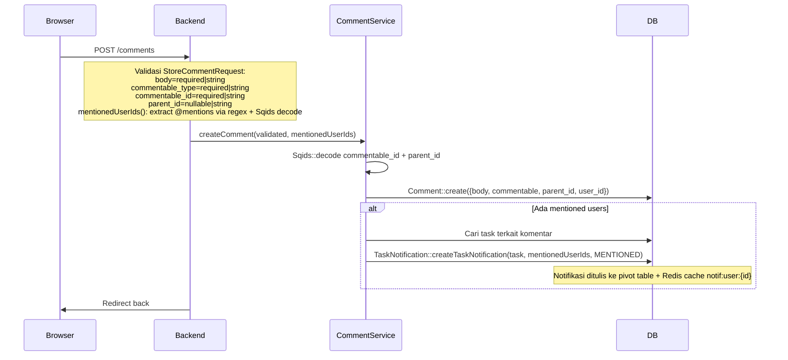
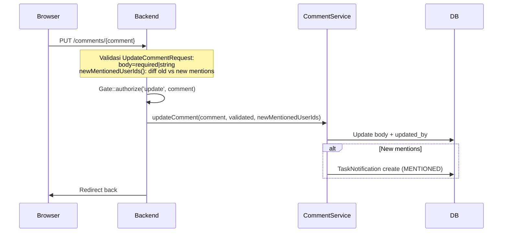
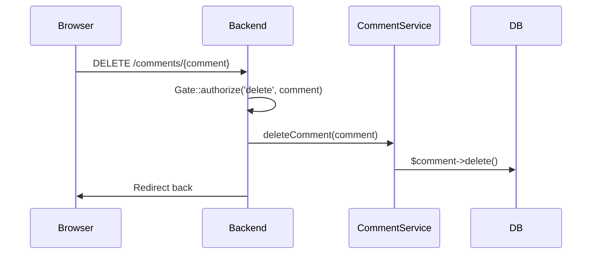
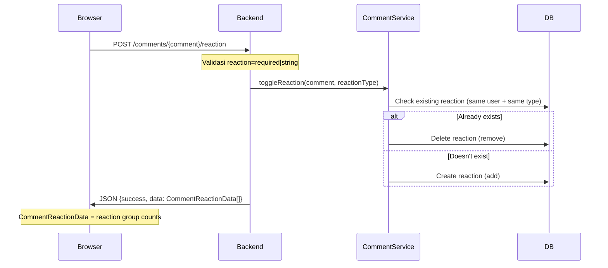

# Comment Management

Sistem komentar pada task (polymorphic) dengan dukungan @mentions dan reactions (toggle).

---

## 1. Create Comment

## 2. Update Comment

## 3. Delete Comment

## 4. Toggle Reaction

## Routes

| Method | URI | Controller |
|--------|-----|------------|
| POST | `/comments` | `CommentController@store` |
| PUT | `/comments/{comment}` | `CommentController@update` |
| DELETE | `/comments/{comment}` | `CommentController@destroy` |
| POST | `/comments/{comment}/reaction` | `CommentController@react` |

## Frontend

| File | Purpose |
|------|---------|
| `pages/project/task/partials/TaskComments.vue` | Comment thread: MentionEditor input + CommentItem list |
| `components/ui/comment/CommentItem.vue` | Individual comment: user avatar, body (rendered HTML), timestamp, reply button, edit/delete, reaction icons |
| `components/ui/comment/CommentEditor.vue` | Comment input dengan @mention support |
| `components/Mentioneditor.vue` | Rich text editor wrapper |

**TaskComments.vue - Post comment flow:**
1. Validasi: cek apakah body kosong (parsed HTML textContent) → toast "Empty Comment"
2. `router.post(route('comments.store'), {body, commentable_type:'App\\Models\\Task', commentable_id, parent_id: null})`
3. Success: clear field + `router.reload({only: ['comments']})` + toast
4. Error: toast "Failed to post comment"

**Reaction flow:** Reaction icons on each comment → POST reaction route → response updates reaction group counts in-place.
