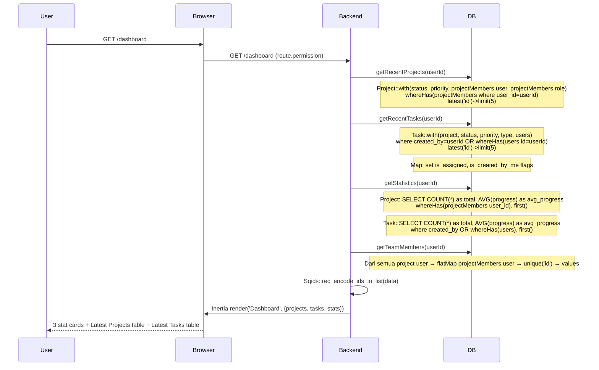
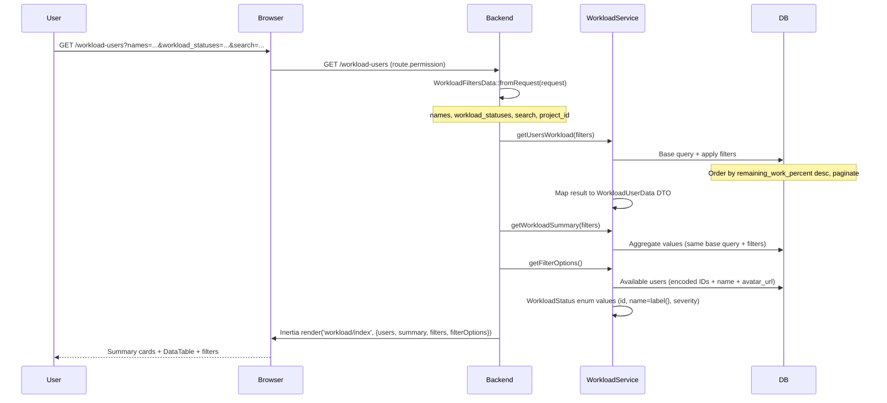

# Dashboard & Workload

---

## 1. Dashboard

Halaman utama setelah login. Menampilkan statistik ringkasan dari project dan task yang diakses user.

### Flow Backend



### Data Props

```typescript
interface Props {
    projects: Project[]   // latest 5
    tasks: Task[]          // latest 5
    stats: {
        tasks: { total: number, progress: number }
        projects: { total: number, progress: number }
        members: { total: number, list: Member[] }
    }
}
```

### Frontend (Dashboard.vue)

| Section | Komponen UI | Detail |
|---------|------------|--------|
| Tasks Stat Card | Card, ProgressBar, Tag | Total + progress bar + computed status breakdown Tags |
| Projects Stat Card | Card, ProgressBar, Tag | Total + progress bar + computed status breakdown Tags |
| Members Stat Card | Card, AvatarGroup | Count + avatar group (max 5 shown + overflow badge) |
| Latest Projects | DataTable | Title (emoji + link), Status (Tag), Priority (Tag), Due date (fromNow / format) |
| Latest Tasks | DataTable | Title (link), Status (Tag), Priority (Tag) |

**Computed properties:**
- `taskStatusBreakdown` — dari `stats.tasks.byStatus` atau di-compute dari `tasks` array (group by status.name)
- `projectStatusBreakdown` — dari `stats.projects.byStatus` atau di-compute dari `projects` array
- `validMembers` — filter null/undefined dari `stats.members.list`

**Navigation:**
- "View All" → `router.get(route('project.index'))` / `router.get(route('task.index'))`
- Row click → `router.visit(route('task.show', id))` / `router.visit(route('project.show', id))`

---

## 2. Workload Users

Monitoring beban kerja pengguna lintas project.

### Flow Backend



### Workload Statuses

| Status | Severity | Deskripsi |
|--------|----------|-----------|
| Free | success | Tidak memiliki task |
| Almost Done | info | Hampir selesai (rendah) |
| Ongoing | warn | Beban normal |
| Overloaded | danger | Beban berlebih (tinggi) |

## Routes

| Method | URI | Controller |
|--------|-----|------------|
| GET | `/dashboard` | `DashboardController@index` |
| GET | `/workload-users` | `WorkLoadUserController@index` |

## Frontend

| File | Purpose |
|------|---------|
| `pages/Dashboard.vue` | Dashboard overview |
| `pages/workload/index.vue` | Workload monitoring |
