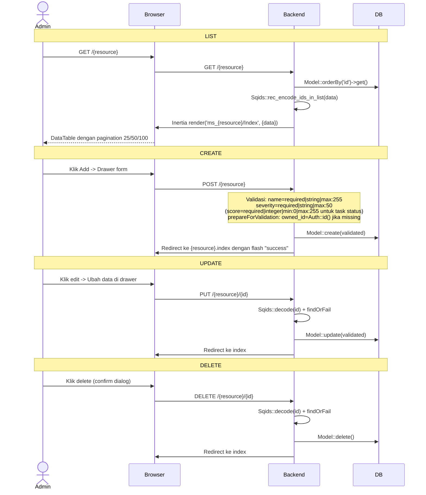
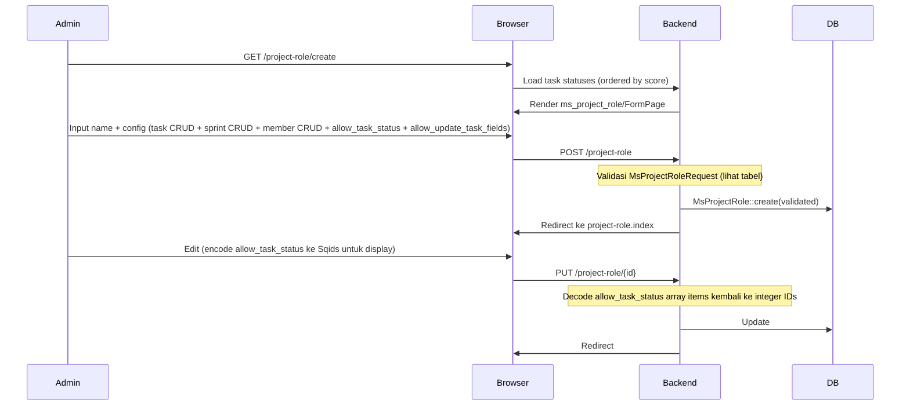

# Master Data Management

Modul referensi untuk mengelola tabel-tabel utama yang digunakan di seluruh aplikasi.

## Daftar Master Data

| Modul | Model | Controller | Route Prefix | Fields (selain owned_id, created_by, deleted_by, timestamps) |
|-------|-------|------------|--------------|-----------------------------------------------|
| Project Status | `MsProjectStatus` | `MsProjectStatusController` | `project-status` | name, severity |
| Project Priority | `MsProjectPriority` | `MsProjectPriorityController` | `project-priority` | name, severity |
| Project Role | `MsProjectRole` | `MsProjectRoleController` | `project-role` | name, config (JSON: task, sprint, project_member CRUD + allow_task_status + allow_update_task_fields) |
| Task Status | `MsTaskStatus` | `MsTaskStatusController` | `task-status` | name, severity, score |
| Task Priority | `MsTaskPriority` | `MsTaskPriorityController` | `task-priority` | name, severity |
| Task Type | `MsTaskType` | `MsTaskTypeController` | `task-type` | name, severity |
| Task Category | `TaskCategory` | `TaskCategoryController` | `task-category` | name, icon, severity |
| Tag | `Tag` | `TagController` | `tag` | name, severity |

## Common CRUD Flow (7 dari 8 modul)

Semua master data selain Project Role mengikuti pola yang sama:



## Validasi Umum

Semua master data basic (kecuali task category dan project role):

| Field | Rule |
|-------|------|
| `name` | required, string, max:255 |
| `severity` | required, string, max:50 |
| `owned_id` | nullable, integer, exists:users,id (auto-set ke `Auth::id()` di prepareForValidation) |

### Task Category Tambahan

| Field | Rule |
|-------|------|
| `name` | required, string, max:255 |
| `icon` | required, string, max:50 |
| `severity` | required, string, max:50 |

### Task Status Tambahan

| Field | Rule |
|-------|------|
| `score` | required, integer, min:0, max:255 (untuk perhitungan progress) |

## Special Case: Project Role

Project Role memiliki halaman **create** dan **edit** sendiri (tidak menggunakan drawer seperti yang lain) dengan `FormPage.vue`.

### Flow



### Validasi MsProjectRoleRequest

| Field | Rule |
|-------|------|
| `name` | required, string, max:255 |
| `owned_id` | nullable, integer, exists:users,id |
| `config` | nullable, array |
| `config.task` | sometimes, array; each: string, in:create,update,delete |
| `config.project_member` | sometimes, array; each: string, in:create,update,delete |
| `config.sprint` | sometimes, array; each: string, in:create,update,delete |
| `config.allow_task_status` | sometimes, array; each: string, SqidExists(MsTaskStatus) |
| `config.allow_update_task_fields` | sometimes, array; each: string, in:TaskField enum cases |

**Note:** Saat update, `allow_task_status` item di-decode dari Sqids kembali ke integer IDs sebelum disimpan.

## Routes

| Resource | Route Prefix | Except |
|----------|-------------|--------|
| Project Status | `project-status` | create, show, edit |
| Project Priority | `project-priority` | create, show, edit |
| Project Role | `project-role` | show |
| Task Status | `task-status` | create, show, edit |
| Task Priority | `task-priority` | create, show, edit |
| Task Type | `task-type` | create, show, edit |
| Task Category | `task-category` | create, show, edit |
| Tag | `tag` | create, show, edit |

## Permission Gating (Frontend)

Setiap halaman master data menerapkan permission gating untuk tindakan:

```vue
<Button v-if="can('project-status.create')" label="Add" />
<Button v-if="can('project-status.update')" @click="edit" />
<Button v-if="can('project-status.delete')" @click="confirmDelete" />
```

## Frontend Pattern

Direktori halaman mengikuti nama view di controller (bukan route prefix):

| Resource | Halaman |
|----------|---------|
| Project Status | `pages/ms_project_status/Index.vue` |
| Project Priority | `pages/ms_project_priority/Index.vue` |
| Project Role | `pages/ms_project_role/Index.vue` + `pages/ms_project_role/FormPage.vue` |
| Task Status | `pages/ms_task_status/Index.vue` |
| Task Priority | `pages/ms_task_priority/Index.vue` |
| Task Type | `pages/ms_task_type/Index.vue` |
| Task Category | `pages/task_category/Index.vue` |
| Tag | `pages/tag/Index.vue` |

| File | Purpose |
|------|---------|
| `pages/ms_{resource}/Index.vue` | Halaman utama: DataTable + Drawer Form |
| `components/DropdownButton.vue` | Action dropdown (Edit/Delete) di setiap row |
