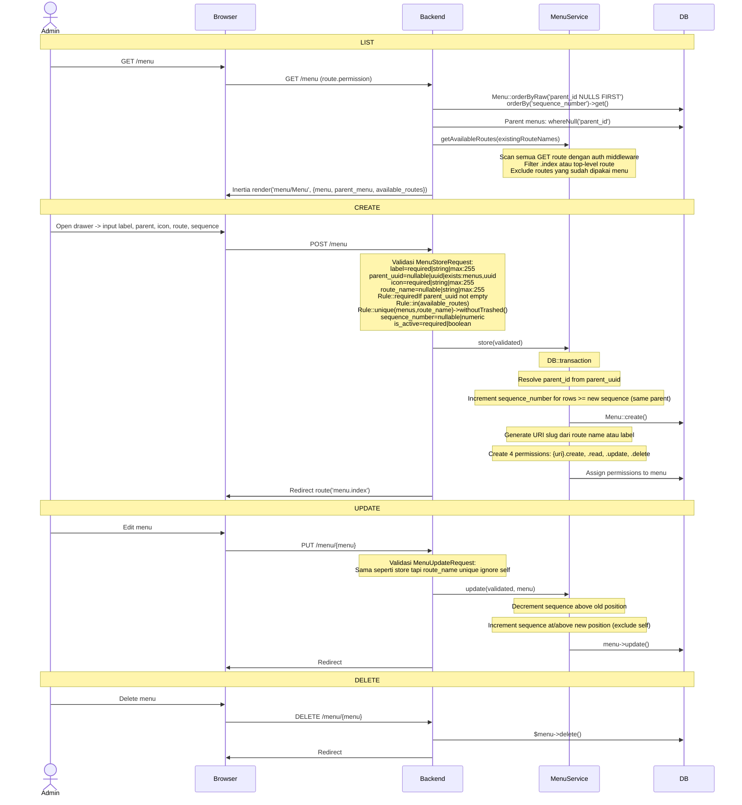

# Menu Management

Manajemen menu navigasi sidebar yang dinamis dengan struktur hierarkis (parent-child).

---

## Flow

## Validasi

### MenuStoreRequest

| Field | Rule |
|-------|------|
| `label` | required, string, max:255 |
| `parent_uuid` | nullable, uuid:4, exists:menus,uuid (resolves to parent_id) |
| `icon` | required, string, max:255 |
| `route_name` | nullable, string, max:255; requiredIf parent_uuid not empty; in(available_routes); unique:menus,route_name (withoutTrashed) |
| `sequence_number` | nullable, numeric |
| `is_active` | required, boolean |

### MenuUpdateRequest

Sama, tapi `route_name` unique ignore self (menu->id).

**passedValidation:** merge `parent_id` dari `Menu::findByUuid(parent_uuid)`.

## Menu Permission Auto-Creation

Saat create menu, `MenuService::store()` otomatis membuat 4 permission:

| Permission | Format |
|------------|--------|
| Create | `{uri}.create` |
| Read | `{uri}.read` |
| Update | `{uri}.update` |
| Delete | `{uri}.delete` |

URI di-generate dari route name (jika ada) atau slug dari label.

## Dynamic Sidebar

Menu yang dibuat via halaman ini ditampilkan di sidebar (`AppMenu.vue` / `AppSidebar.vue`). Menu bersifat:
- Hierarkis (parent_id NULL untuk top-level, non-NULL untuk submenu)
- Diurutkan berdasarkan `sequence_number`
- Dapat diaktifkan/dinonaktifkan dengan toggle `is_active`

## Routes

| Method | URI | Controller | Model Binding |
|--------|-----|------------|---------------|
| GET | `/menu` | `MenuController@index` | — |
| POST | `/menu` | `MenuController@store` | — |
| PUT | `/menu/{menu}` | `MenuController@update` | UUID |
| DELETE | `/menu/{menu}` | `MenuController@destroy` | UUID |

## Frontend

| File | Purpose |
|------|---------|
| `pages/menu/Menu.vue` | DataTable: Label, Parent, Icon (rendered via Icon.vue), Route Name, Sequence, Status (active/nonactive), Actions |
| `pages/menu/MenuForm.vue` | Drawer form: Label, Parent (Select), Icon (Select), Route (Select from available), Sequence, Active toggle |
