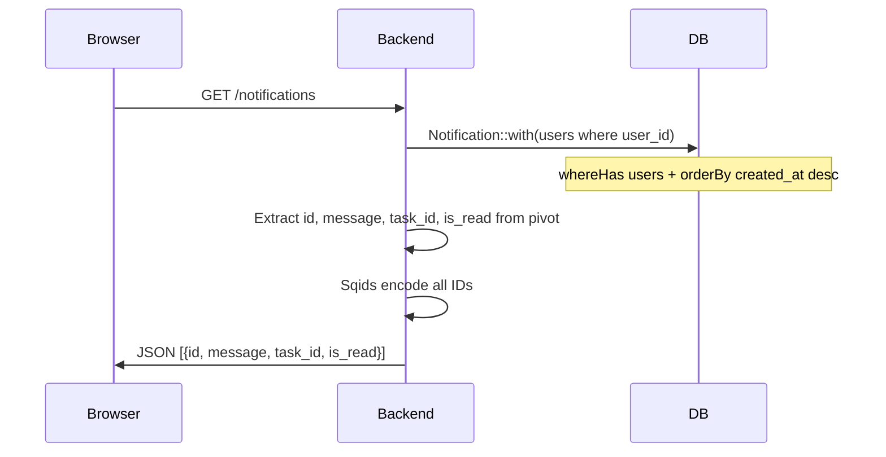
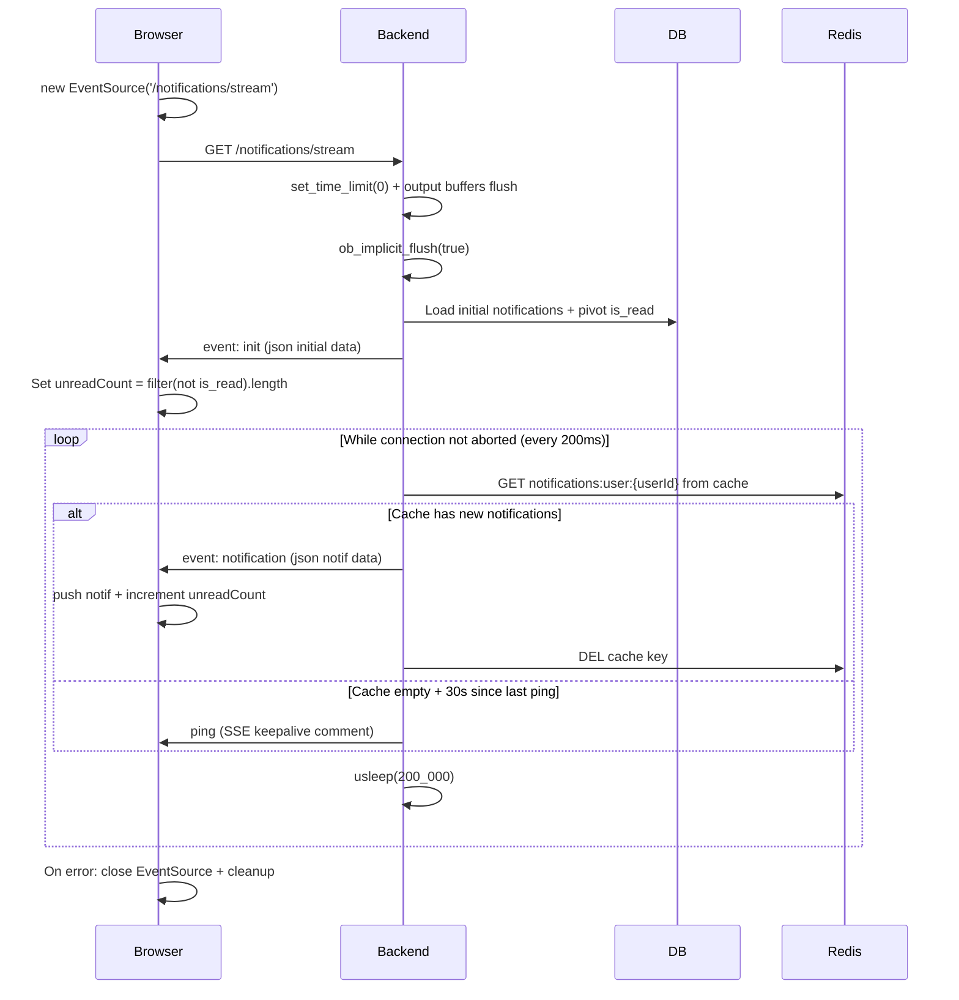
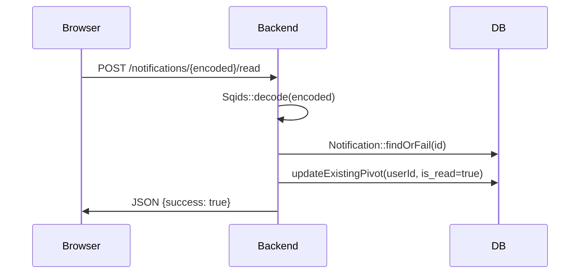
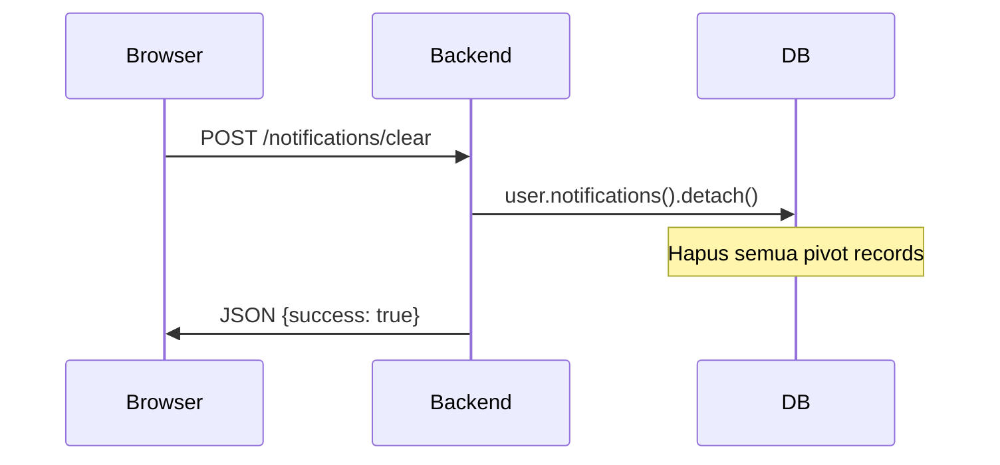

# Notification Management

Sistem notifikasi real-time menggunakan Server-Sent Events (SSE) dengan EventSource di frontend dan Redis cache di backend.

---

## 1. List Notifications



## 2. SSE Stream (Real-time)



**SSE Response Headers:**
- `Content-Type: text/event-stream`
- `Cache-Control: no-cache`
- `Connection: keep-alive`
- `Content-Encoding: none`
- `X-Accel-Buffering: no` (untuk nginx)

## 3. Mark As Read



### Frontend (NotificationProvider.vue)

```typescript
// markAsRead with optimistic update + rollback
const currentCount = unreadCount.value  // save previous
unreadCount.value--                      // optimistic update
notif.is_read = true                     // optimistic update
try {
    await axios.post(route('notifications.read', {encoded: notificationId}))
} catch (error) {
    unreadCount.value = currentCount     // rollback
    notif.is_read = false                 // rollback
}
```

## 4. Clear All



### Frontend

```typescript
// clearNotifications with optimistic update
const currentCount = unreadCount.value
try {
    unreadCount.value = 0
    await axios.post(route('notifications.clear'))
    notifications.value = []
} catch (error) {
    unreadCount.value = currentCount  // rollback
}
```

## Redis Notification Queue

Saat notifikasi dibuat oleh service (TaskService/CommentService):

```php
// TaskNotificationService::createTaskNotification()
Notification::create([...])        // Simpan ke DB
$user->notifications()->attach()   // Pivot: is_read = false
Redis::rpush("notifications:user:$userId", json_encode(notif))
Redis::expire("notifications:user:$userId", 60)  // TTL 1 menit
```

**Note:** Notifikasi juga dikirim ke user dengan role `watcher-admin`.

## Routes

| Method | URI | Controller |
|--------|-----|------------|
| GET | `/notifications` | `NotificationController@index` |
| GET | `/notifications/stream` | `NotificationController@stream` |
| POST | `/notifications/{encoded}/read` | `NotificationController@markAsRead` |
| POST | `/notifications/clear` | `NotificationController@clearAll` |

## Frontend

| File | Purpose |
|------|---------|
| `provider/NotificationProvider.vue` | SSE EventSource + provide notif state |
