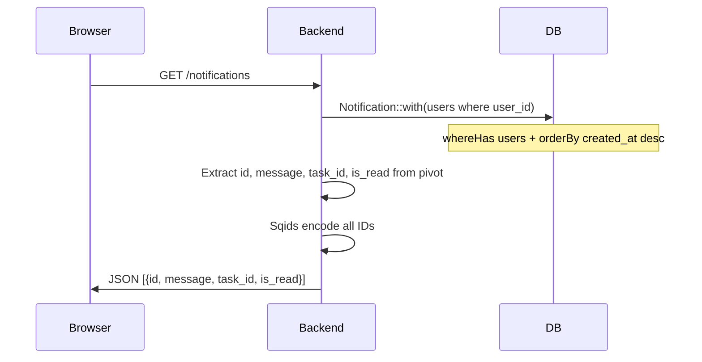
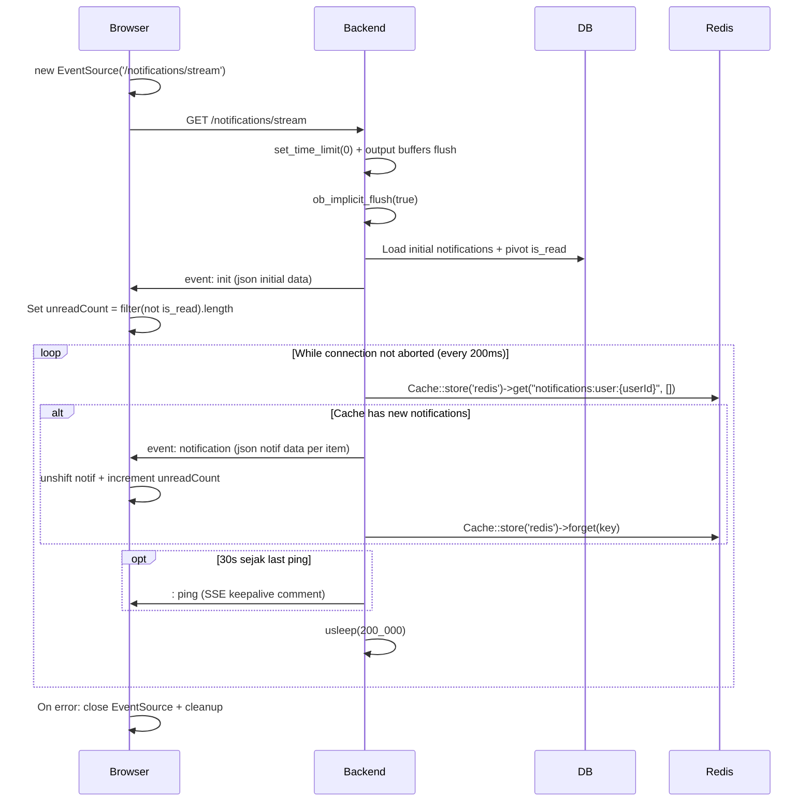
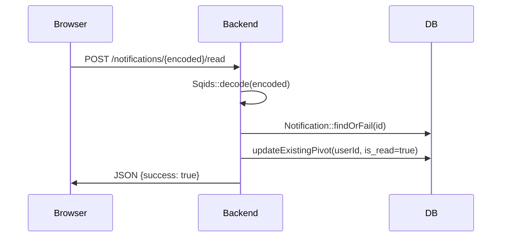
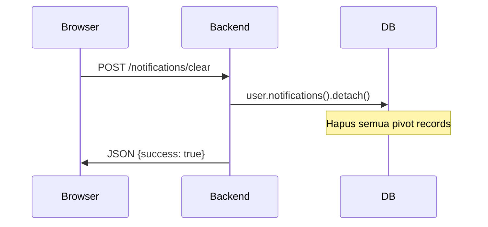

# Notification Management

Sistem notifikasi real-time menggunakan Server-Sent Events (SSE) dengan EventSource di frontend dan Redis cache di backend.

---

## 1. List Notifications



## 2. SSE Stream (Real-time)



**SSE Response Headers:**
- `Content-Type: text/event-stream`
- `Cache-Control: no-cache`
- `Connection: keep-alive`
- `Content-Encoding: none`
- `X-Accel-Buffering: no` (untuk nginx)

## 3. Mark As Read



### Frontend (NotificationProvider.vue)

```typescript
// markAsRead with optimistic update + rollback
const currentCount = unreadCount.value           // save previous
const notif = notifications.value.find((n) => n.id === notificationId)
try {
    unreadCount.value--                           // optimistic update
    if (notif) notif.is_read = true               // optimistic update
    await axios.post(route('notifications.read', { encoded: notificationId }))
} catch (error) {
    unreadCount.value = currentCount              // rollback
    if (notif) notif.is_read = false              // rollback
}
```

## 4. Clear All



### Frontend

```typescript
// clearNotifications with optimistic update
const currentCount = unreadCount.value
try {
    unreadCount.value = 0
    await axios.post(route('notifications.clear'))
    notifications.value = []
} catch (error) {
    unreadCount.value = currentCount  // rollback
}
```

## Redis Notification Queue

Notifikasi dibuat lewat facade `TaskNotification` (mengarah ke `TaskNotificationService`).
Pemicunya antara lain: listener `NotifyAssignedUsers` (event `TaskCreated`),
`TaskObserver`, `CreateTaskAction`/`UpdateTaskAction`, `TaskService`,
`CommentService`, dan `ProjectController`.

```php
// TaskNotificationService::createTaskNotification($task, $userIds, TaskNotificationType $type)
$notification = Notification::create([
    'task_id' => $task->id,
    'task_status_id' => $task->status_id,
    'task_type_id' => $task->type_id,
    'message' => ...,
]);

foreach ($userIds as $userId) {
    $notification->users()->attach($userId, ['is_read' => false]); // Pivot

    $payload = ['id' => Sqids::encode(...), 'message' => ..., 'task_id' => Sqids::encode(...), 'is_read' => false];

    $key = "notifications:user:$userId";
    $existing = Cache::store('redis')->get($key, []);
    $existing[] = $payload;
    Cache::store('redis')->put($key, $existing, now()->addMinutes(1)); // TTL 1 menit
}
```

**Note:** ID notifikasi & task pada payload Redis sudah di-encode Sqids. Notifikasi juga dikirim ke user dengan role `watcher-admin` (digabung ke `$userIds`).

## Routes

| Method | URI | Controller |
|--------|-----|------------|
| GET | `/notifications` | `NotificationController@index` |
| GET | `/notifications/stream` | `NotificationController@stream` |
| POST | `/notifications/{encoded}/read` | `NotificationController@markAsRead` |
| POST | `/notifications/clear` | `NotificationController@clearAll` |

## Frontend

| File | Purpose |
|------|---------|
| `provider/NotificationProvider.vue` | SSE EventSource + provide notif state |
