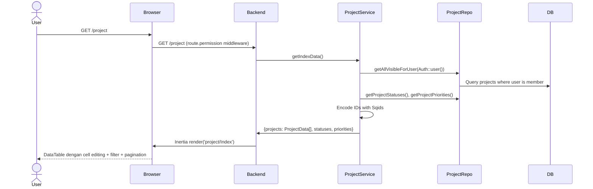
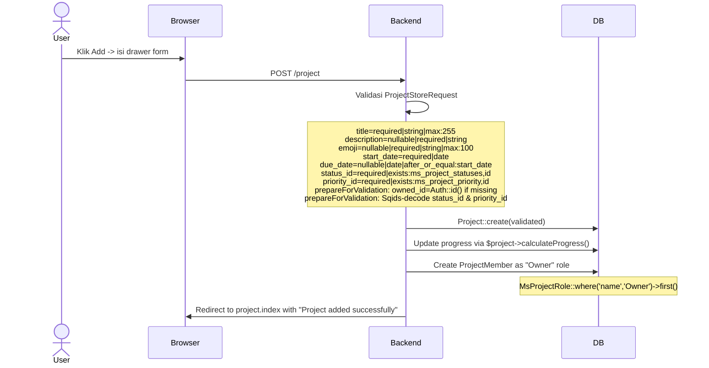
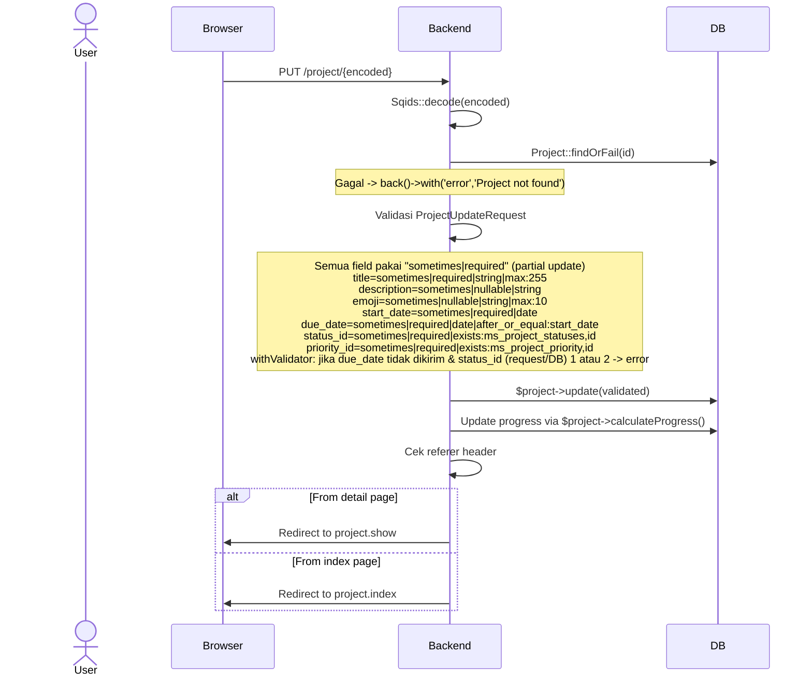
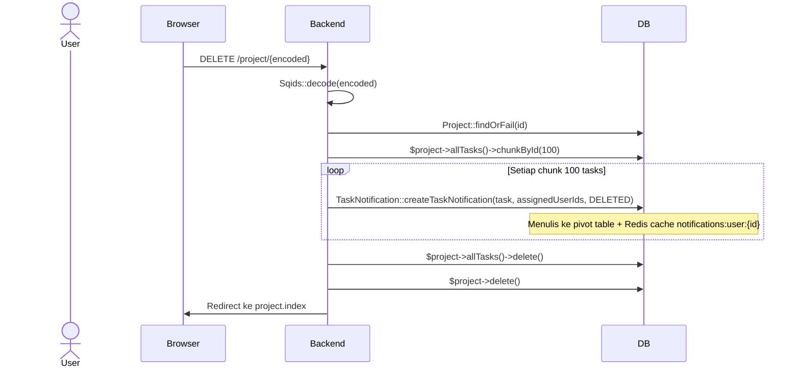
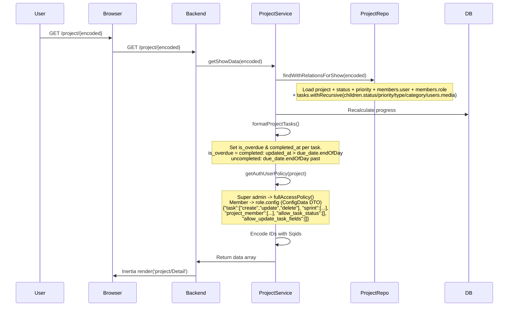
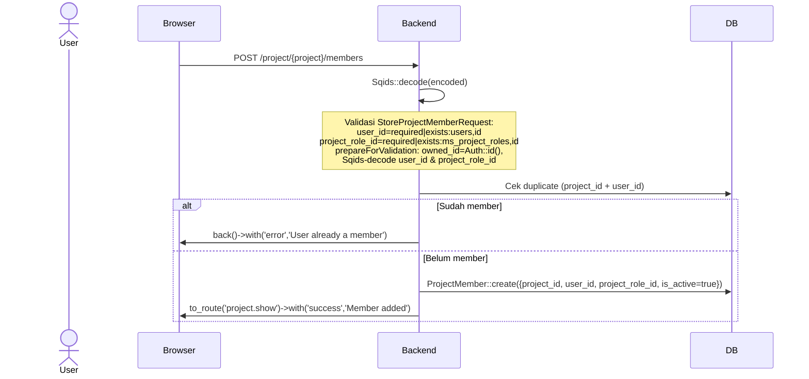
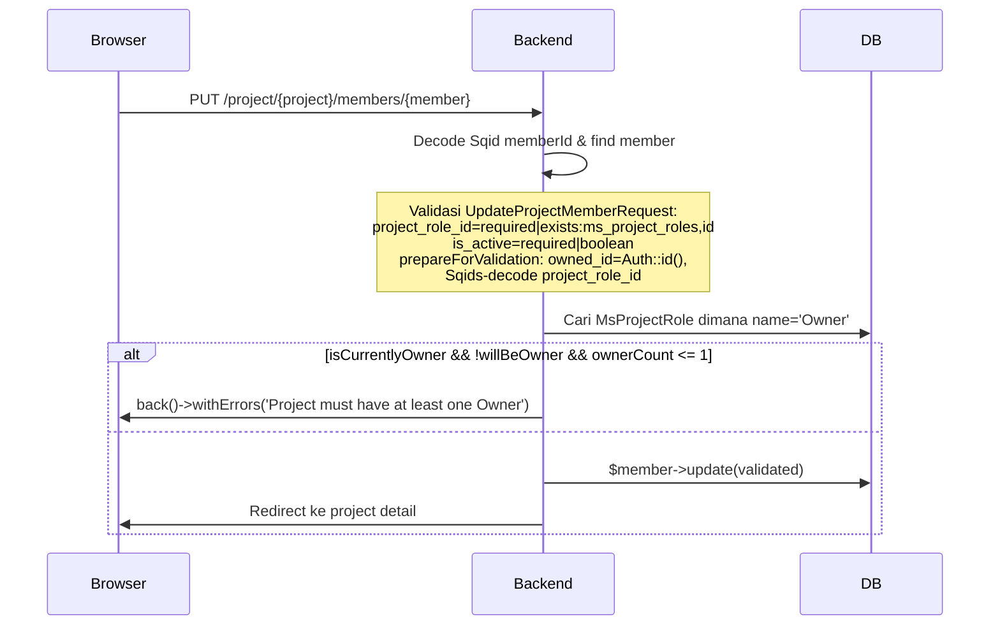
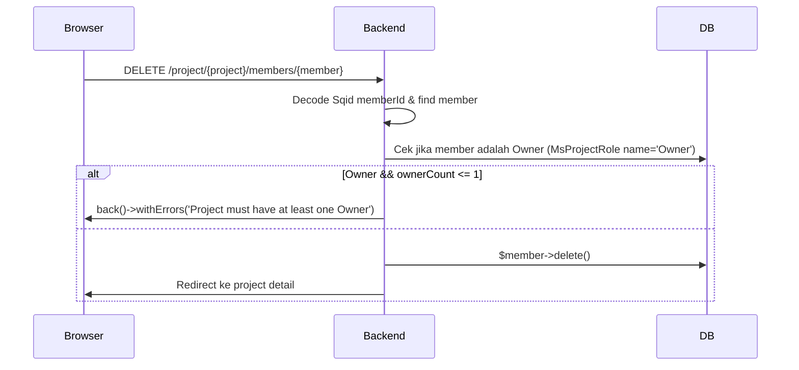

# Project Management

CRUD project dengan detail page 7 tab, manajemen anggota, summary, dan policy permissions.

---

## 1. Project List (Index)

### Flow Backend

### Frontend (Table.vue)

**Editing inline:** Cell-by-cell via `editableMode="cell"`. Setiap kolom yang bisa diedit langsung trigger `router.put(route('project.update'))`.

**Filters:**
- Search global (input text)
- Status (MultiSelect)
- Priority (MultiSelect)
- Date range (DatePicker)
- Progress (Slider)

**Pagination:** 10/25/50 per page, default 25.

---

## 2. Create Project

### Flow Backend

### Validasi Lengkap (ProjectStoreRequest)

| Field | Rule |
|-------|------|
| `title` | required, string, max:255 |
| `description` | nullable, required, string |
| `emoji` | nullable, required, string, max:100 |
| `start_date` | required, date |
| `due_date` | nullable, date, after_or_equal:start_date |
| `status_id` | required, exists:ms_project_statuses,id |
| `priority_id` | required, exists:ms_project_priority,id |

**prepareForValidation:** `owned_id` di-set ke `Auth::id()` jika tidak ada. `status_id` dan `priority_id` di-decode dari Sqids ke integer.

---

## 3. Update Project

### Flow Backend

### Validasi Lengkap (ProjectUpdateRequest)

| Field | Rule |
|-------|------|
| `title` | sometimes, required, string, max:255 |
| `description` | sometimes, nullable, string |
| `emoji` | sometimes, nullable, string, max:10 |
| `start_date` | sometimes, required, date |
| `due_date` | sometimes, required, date, after_or_equal:start_date |
| `status_id` | sometimes, required, exists:ms_project_statuses,id |
| `priority_id` | sometimes, required, exists:ms_project_priority,id |

**withValidator:** Jika `due_date` dikirim, rule biasa jalan. Jika tidak: ambil `status_id` dari request atau dari DB (`projects.status_id`), lalu jika status = 1 atau 2 tambahkan error `due_date` ("Due date is required when status is set to..."). **prepareForValidation:** `owned_id` di-set ke `Auth::id()` jika tidak ada; `status_id` dan `priority_id` di-decode dari Sqids.

---

## 4. Delete Project

---

## 5. Project Detail (Show)

### Flow Backend

**Data yang dikembalikan:** `project`, `members` (DTO format), `roles`, `users` (non-members, available), `tasks` (with is_overdue + completed_at + media), `taskStatuses`, `taskPriorities`, `taskTypes`, `tags`, `assignableUsers` (members only), `statuses`, `priorities`, `sprints` (active), `backlog`, `taskCategories`, `epics` (encode IDs), `isMember` (boolean), `policy` (ConfigData)

### Frontend Detail Page

7 Tabs dengan active tab disimpan per-user di sessionStorage (`project-detail-active-tab-{userId}`):

| Tab | Komponen | Deskripsi |
|-----|----------|-----------|
| Kanban | `TaskKanbanBoard.vue` | Drag-drop board per status kolom (vue-draggable-plus) |
| List | `task/Table.vue` | TreeTable hierarchical dengan drag reparent (hold 900ms) |
| Backlog | `task/Backlog.vue` | Sprint sections + backlog list drag-drop |
| Details | `ProjectDetailsTab.vue` | Description (Quill editor) + timestamps |
| Team | `member/Table.vue` | Members CRUD (add/edit/delete) |
| Timeline | `ProjectGanttChart.vue` | Highcharts Gantt chart semua task |
| Report | `ProjectReportTab.vue` | Sprint selector + burndown + status report |

**Dialog/Drawer:**
- `MemberAddForm` — Add member via AutoComplete user search + role Select
- `MemberEditForm` — Edit role & active status
- `TaskForm` — Drawer right side, 50rem width, maximizable

---

## 6. Project Members

### Policy Enforcement

Di level project detail, permission diatur oleh ConfigData dari role member:
- `project_member: ['create','update','delete']` — CRUD member
- `task: ['create','update','delete']` — CRUD task
- `sprint: ['create','update','delete']` — CRUD sprint
- Super admin selalu mendapat full access (semua CRUD)

### Flow Add Member

### Flow Update Member

### Flow Delete Member

---

## 7. Project Summary

Single-action controller (`ProjectSummaryController@__invoke`).

**Response JSON:**

| Key | Deskripsi |
|-----|-----------|
| `statusOverview` | Count grouped by status.name + color dari status.severity |
| `priorityBreakdown` | Count grouped by priority.name |
| `categoryBreakdown` | Count grouped by category.name (default "Uncategorized") |
| `teamWorkload` | Per user: name, avatar_url, total tasks, completed count |
| `epicProgress` | Epic dengan children: id, title, progress%, total children, done count |
| `recentActivity` | 10 task terakhir: id, title, status, updated_at, users (name + avatar) |

**Authorization:** `Auth::user()->cannot('view', $project)` → `abort(403)`.

---

## Routes

| Method | URI | Controller | Middleware |
|--------|-----|------------|------------|
| GET | `/project` | `ProjectController@index` | `route.permission` |
| POST | `/project` | `ProjectController@store` | `route.permission` |
| GET | `/project/{encoded}` | `ProjectController@show` | `route.permission` |
| PUT | `/project/{project}` | `ProjectController@update` | `route.permission` |
| DELETE | `/project/{project}` | `ProjectController@destroy` | `route.permission` |
| GET | `/project/{encoded}/summary` | `ProjectSummaryController` | `route.permission` |
| POST | `/project/{project}/members` | `ProjectMemberController@store` | `auth` |
| PUT | `/project/{project}/members/{member}` | `ProjectMemberController@update` | `auth` |
| DELETE | `/project/{project}/members/{member}` | `ProjectMemberController@destroy` | `auth` |

## Frontend Files

| File | Purpose |
|------|---------|
| `pages/project/Index.vue` | Wrapper pass data ke Table.vue |
| `pages/project/Table.vue` | DataTable dengan inline cell edit (editableMode="cell") |
| `pages/project/Detail.vue` | Detail 7 tabs + dialog/drawer management |
| `pages/project/Form.vue` | Drawer form create |
| `pages/project/partials/ProjectHeader.vue` | Header title + emoji inline edit + member avatars |
| `pages/project/partials/ProjectStats.vue` | 4 stat cards: Status, Priority, Timeline (editable dates), Progress bar |
| `pages/project/partials/ProjectDetailsTab.vue` | Deskripsi (Quill editor) + timestamps |
| `pages/project/partials/ProjectReportTab.vue` | Sprint selector -> Burndown + Status report |
| `pages/project/member/Table.vue` | DataTable members |
| `pages/project/member/Form.vue` | Add member dialog |
| `pages/project/member/EditFormTemp.vue` | Edit member dialog |
| `components/ProjectGanttChart.vue` | Highcharts Gantt chart |
| `composables/useProjectPermissions.ts` | canAction, canUpdateTaskStatus, canUpdateTaskField |
