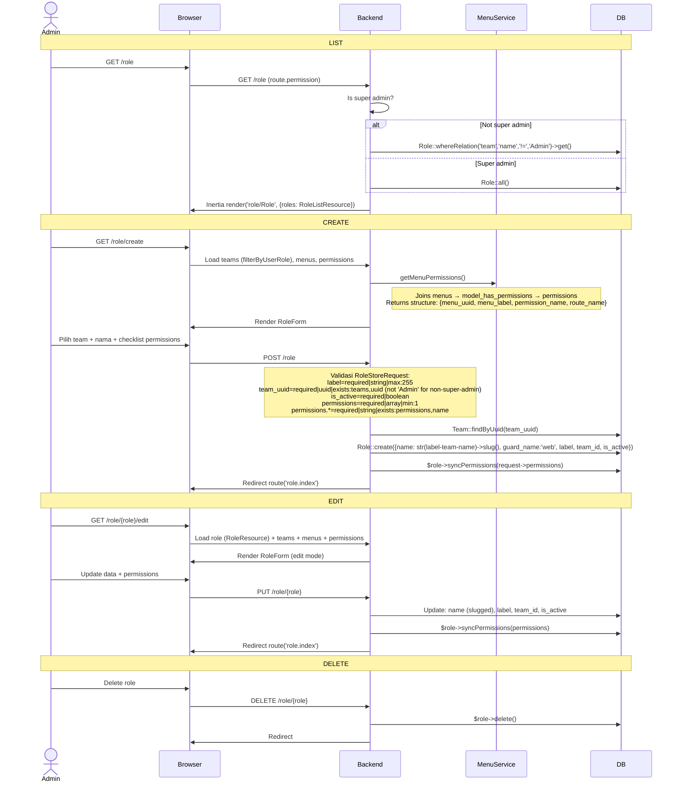

# Role Management

Manajemen role/peran dengan pengaturan permission berbasis menu (CRUD per menu item).

---

## Flow

## Validasi (RoleStoreRequest)

| Field | Rule |
|-------|------|
| `label` | required, string, max:255 |
| `team_uuid` | required, uuid, exists:teams,uuid (filter: not 'Admin' for non-super-admin) |
| `is_active` | required, boolean |
| `permissions` | required, array, min:1 |
| `permissions.*` | required, string, exists:permissions,name |

## Role Naming Convention

Role name di-generate otomatis: `str(label-teamname)->slug()`

Contoh: label="Developer", team="Engineering" → name="developer-engineering"

## Permission Structure

Permission format: `{uri}.{action}` (e.g., `project.create`, `project.read`, `project.update`, `project.delete`)

Setiap menu menghasilkan 4 permissions: `create`, `read`, `update`, `delete`.

## Routes

| Method | URI | Controller |
|--------|-----|------------|
| GET | `/role` | `RoleController@index` |
| GET | `/role/create` | `RoleController@create` |
| POST | `/role` | `RoleController@store` |
| GET | `/role/{role}/edit` | `RoleController@edit` |
| PUT | `/role/{role}` | `RoleController@update` |
| DELETE | `/role/{role}` | `RoleController@destroy` |

## Frontend

| File | Purpose |
|------|---------|
| `pages/role/Role.vue` | Halaman list (wrapper, render RoleListTable) |
| `pages/role/partials/RoleListTable.vue` | DataTable role dengan actions |
| `pages/role/RoleForm.vue` | Form create/edit: Team Select, Role Name, Active ToggleSwitch, permission matrix |
| `pages/role/partials/SetupPermission.vue` | Hierarchical checkbox tree per menu item |
