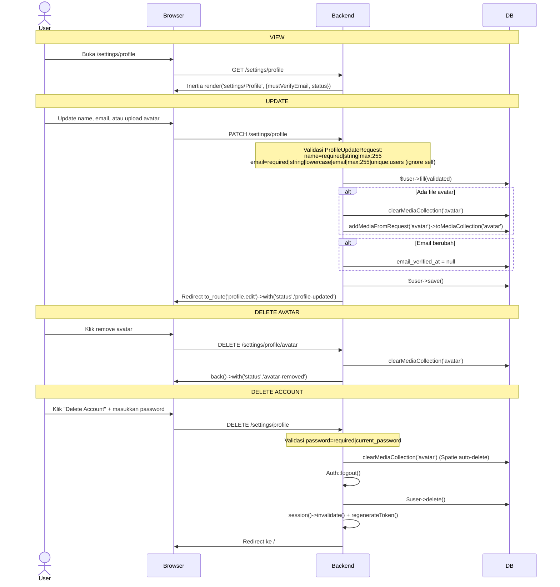
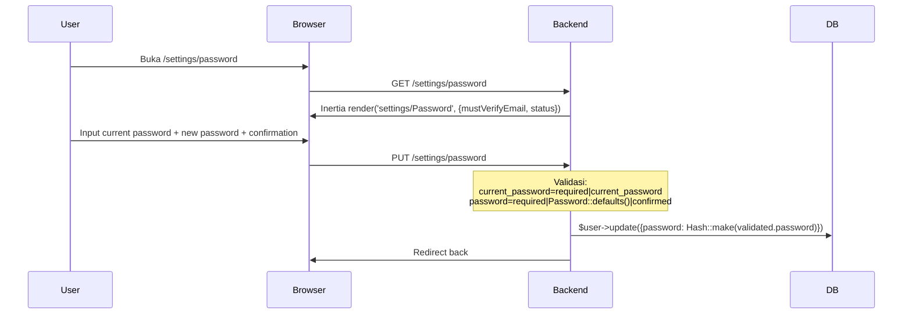
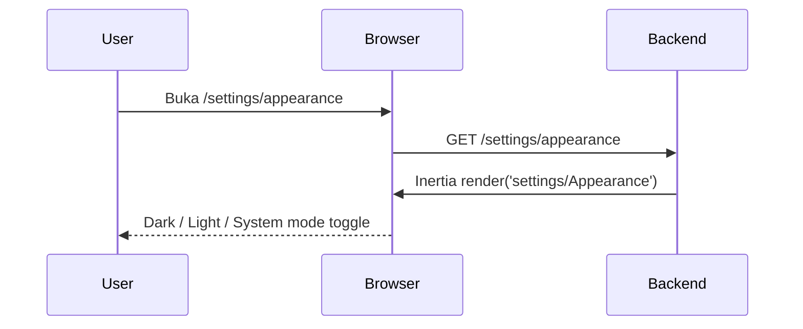

# Settings

Pengaturan pengguna: Profile (name, email, avatar), Password, Appearance (dark/light mode).

---

## 1. Profile

## 2. Password

## 3. Appearance

## Validasi

### ProfileUpdateRequest

| Field | Rule |
|-------|------|
| `name` | required, string, max:255 |
| `email` | required, string, lowercase, email, max:255, unique:users (ignore self by id) |

### Password Update

| Field | Rule |
|-------|------|
| `current_password` | required, current_password |
| `password` | required, Password::defaults(), confirmed |

### Delete Account

| Field | Rule |
|-------|------|
| `password` | required, current_password |

## Routes

| Method | URI | Controller | Name |
|--------|-----|------------|------|
| GET | `/settings` | Redirect | `/settings/profile` |
| GET | `/settings/profile` | `ProfileController@edit` | `profile.edit` |
| PATCH | `/settings/profile` | `ProfileController@update` | `profile.update` |
| DELETE | `/settings/profile` | `ProfileController@destroy` | `profile.destroy` |
| DELETE | `/settings/profile/avatar` | `ProfileController@destroyAvatar` | `profile.avatar.destroy` |
| GET | `/settings/password` | `PasswordController@edit` | `password.edit` |
| PUT | `/settings/password` | `PasswordController@update` | `password.update` |
| GET | `/settings/appearance` | Inline Inertia render | `appearance` |

## Frontend

| File | Purpose |
|------|---------|
| `pages/settings/Profile.vue` | Edit name, email, avatar upload (FileUpload + Cropper.js), delete account form |
| `pages/settings/Password.vue` | Current + new password + confirm |
| `pages/settings/Appearance.vue` | Dark/Light/System toggle |
| `layouts/settings/Layout.vue` | Settings sub-layout dengan side nav |
