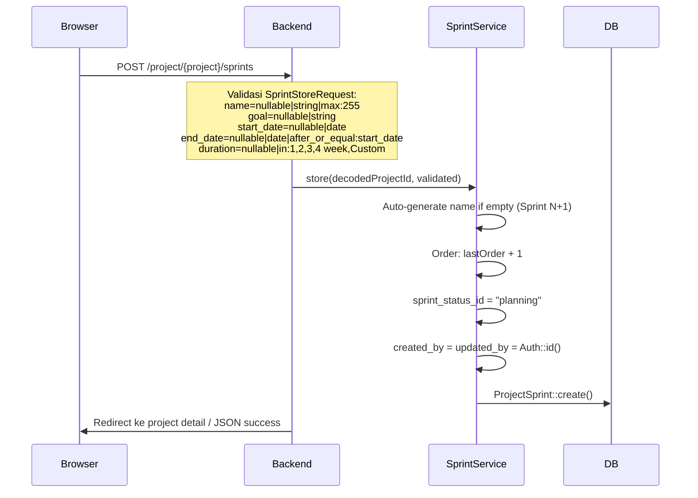
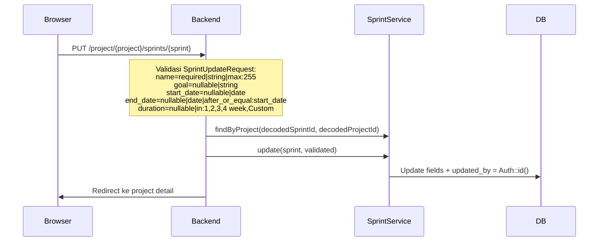
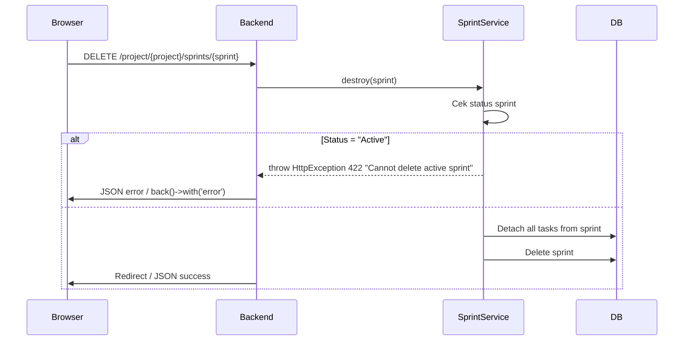
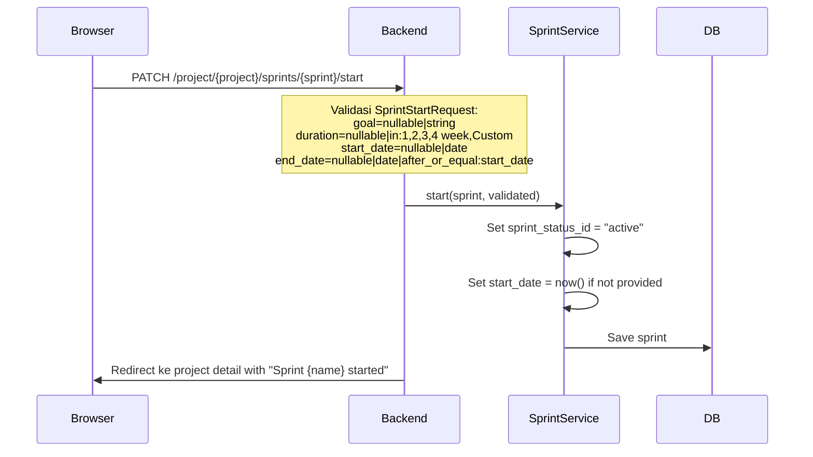
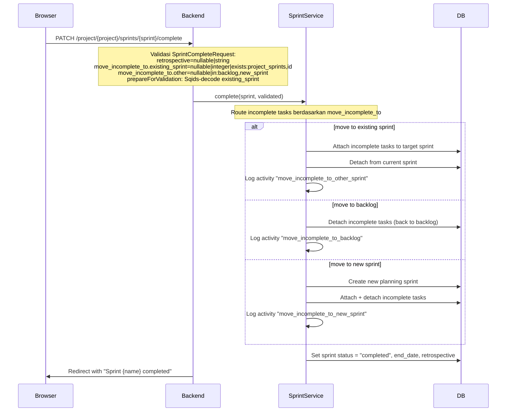
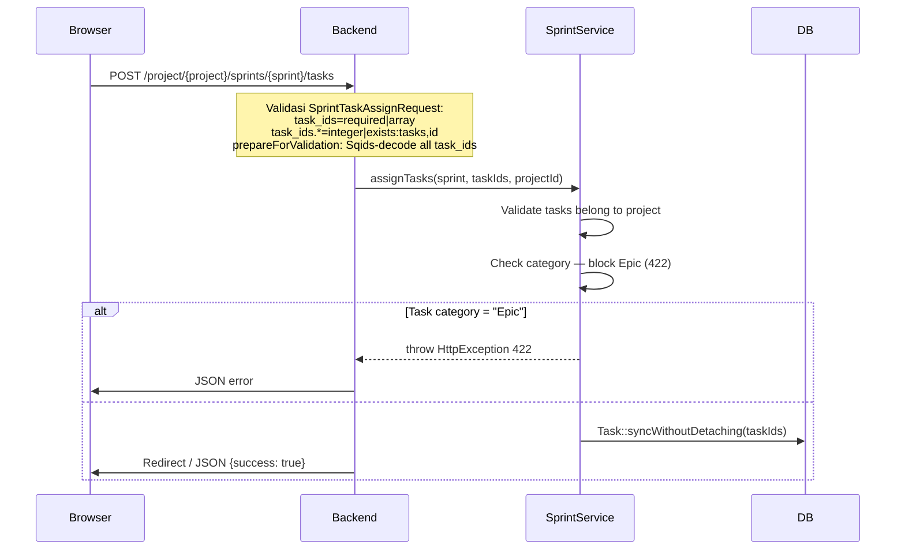
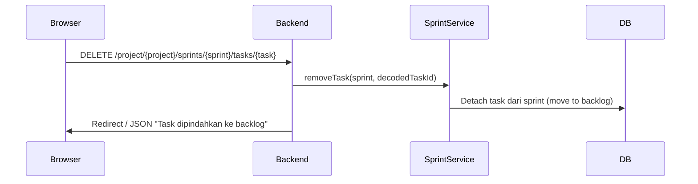

# Sprint Management

Manajemen sprint dalam project: CRUD, lifecycle (planning → active → completed), dan task assignment.

---

## 1. Sprint CRUD

### Flow Create

### Flow Update

### Flow Delete

---

## 2. Sprint Lifecycle

### Start Sprint

### Complete Sprint

---

## 3. Task Assignment

### Assign Task to Sprint

### Remove Task from Sprint

---

## Routes

| Method | URI | Controller | Status |
|--------|-----|------------|--------|
| GET | `/project/{project}/sprints` | `SprintController@index` | JSON |
| POST | `/project/{project}/sprints` | `SprintController@store` | Redirect / JSON |
| PUT | `/project/{project}/sprints/{sprint}` | `SprintController@update` | Redirect |
| DELETE | `/project/{project}/sprints/{sprint}` | `SprintController@destroy` | Redirect / JSON |
| PATCH | `/project/{project}/sprints/{sprint}/start` | `SprintController@start` | Redirect |
| PATCH | `/project/{project}/sprints/{sprint}/complete` | `SprintController@complete` | Redirect |
| POST | `/project/{project}/sprints/{sprint}/tasks` | `SprintController@assignTask` | Redirect / JSON |
| DELETE | `/project/{project}/sprints/{sprint}/tasks/{task}` | `SprintController@removeTask` | Redirect / JSON |
| GET | `/project/{project}/sprints/all` | `SprintReportController@index` | JSON |
| GET | `/project/{project}/sprints/{sprint}/burndown` | `SprintReportController@burndown` | JSON |
| GET | `/project/{project}/sprints/{sprint}/status-report` | `SprintReportController@statusReport` | JSON |

## Frontend Backlog Board (Backlog.vue)

**Komponen utama di tab Backlog:**

| Sub-komponen | Purpose |
|---|---|
| `SprintSection.vue` | Sprint card collapsible dengan: name, status Tag, date range, issue count, progress bar, Start/Complete buttons, drag-drop task rows, context menu (Edit/Start/Complete/Delete sprint) |
| `BacklogSection.vue` | "Backlog" header + issue count + Create Sprint button + drag-drop rows |
| `Taskrow.vue` | Drag handle + checkbox + category icon + title + story points + inline: Epic picker, Priority Select, Status Tag, Member avatars |
| `StartSprintDialog.vue` | Set goal, duration (1-4 weeks/Custom), start/end dates |
| `EditSprintDialog.vue` | Edit name, goal, duration, dates |
| `CompleteSprintDialog.vue` | Set retrospective, choose incomplete task destination |

**Permission checks (via `useProjectPermissions`):**
- `canSprintCreate` → tombol Create Sprint
- `canSprintUpdate` → tombol Edit Sprint
- `canSprintDelete` → tombol Delete Sprint
- `canTaskCreate` → tombol Create Task di backlog/sprint

**Provide/Inject:** `BacklogKey` symbol menyediakan epics, task priorities, actions (edit, add epic, update priority, view epic, toggle select, open menu, add task, add parent) ke semua child components.
