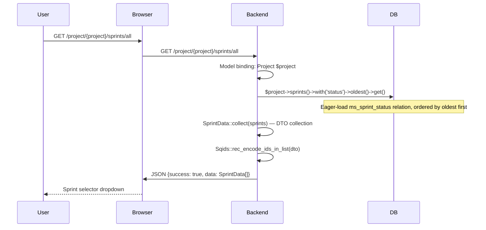
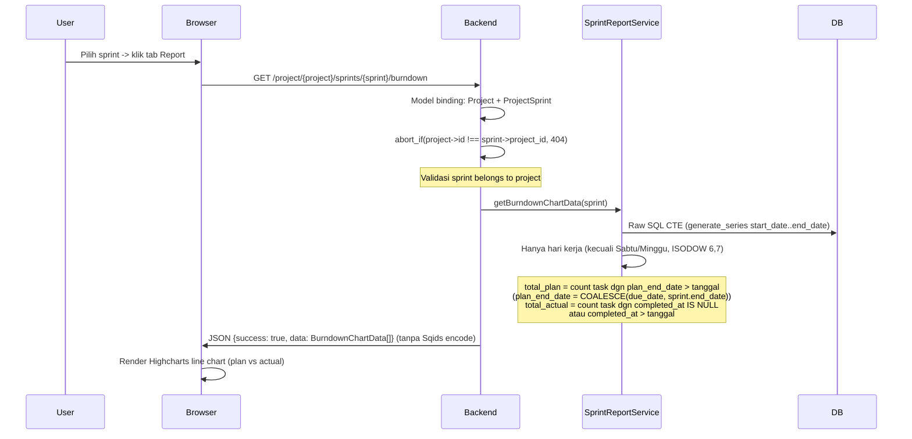
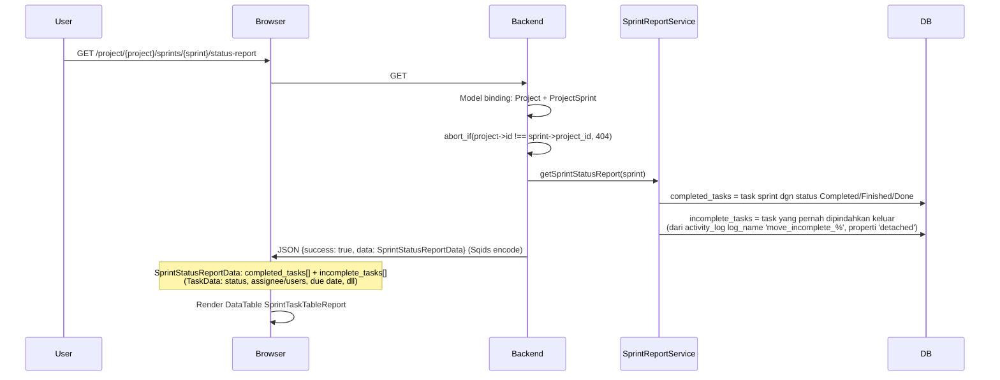

# Sprint Report

Laporan sprint mencakup burndown chart dan status report untuk sprint yang sudah berjalan.

---

## 1. All Sprints

---

## 2. Burndown Chart

**BurndownChartData per data point:**
- `date` — tanggal
- `label` — `DAY-N` (urut hari kerja)
- `total_plan` — sisa task rencana
- `total_actual` — sisa task aktual (belum selesai)

---

## 3. Status Report

---

## Routes

| Method | URI | Controller | Validasi |
|--------|-----|------------|----------|
| GET | `/project/{project}/sprints/all` | `Api\SprintReportController@index` | Project model binding |
| GET | `/project/{project}/sprints/{projectSprint}/burndown` | `Api\SprintReportController@burndown` | abort_if project->id !== projectSprint->project_id |
| GET | `/project/{project}/sprints/{projectSprint}/status-report` | `Api\SprintReportController@statusReport` | abort_if project->id !== projectSprint->project_id |

## Frontend Components

| File | Purpose |
|------|---------|
| `pages/project/partials/ProjectReportTab.vue` | Tab Report: sprint selector + burndown + status report |
| `pages/project/partials/SprintBurndown.vue` | Highcharts line chart (ideal vs actual) |
| `pages/project/partials/SprintTaskTableReport.vue` | DataTable completed + incomplete sprint tasks |
