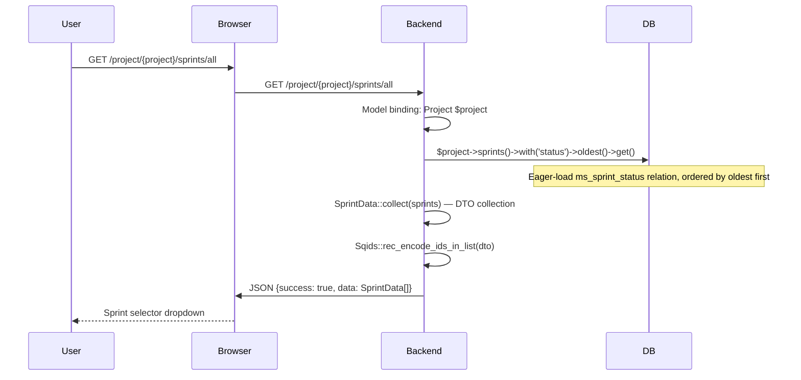
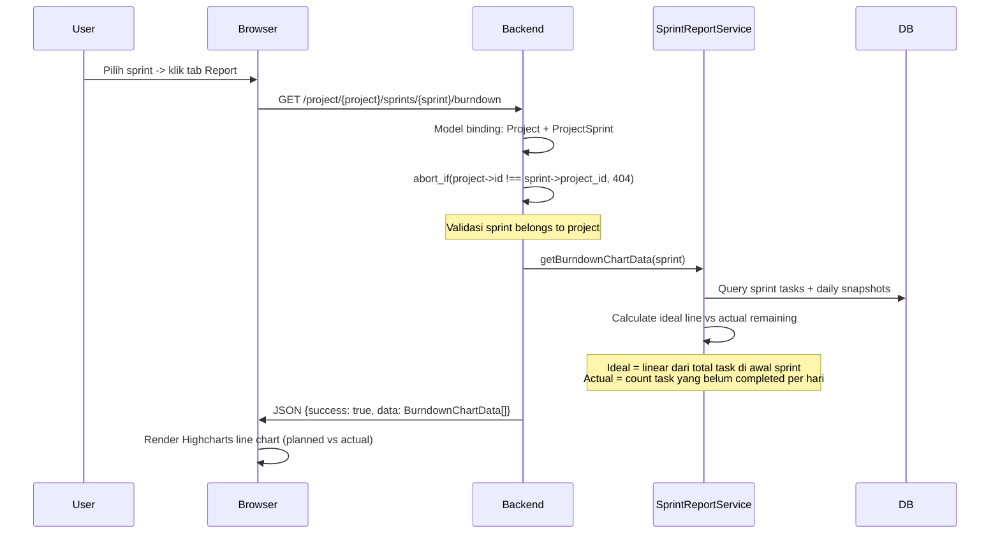
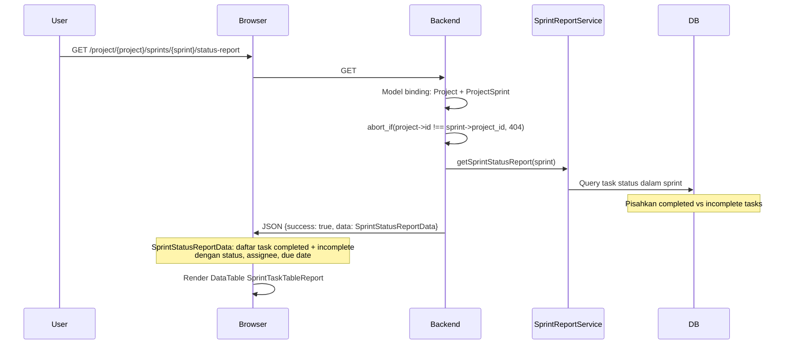

# Sprint Report

Laporan sprint mencakup burndown chart dan status report untuk sprint yang sudah berjalan.

---

## 1. All Sprints

---

## 2. Burndown Chart

**BurndownChartData per data point:**
- `date` — tanggal
- `ideal` — remaining ideal (linear)
- `actual` — remaining aktual

---

## 3. Status Report

---

## Routes

| Method | URI | Controller | Validasi |
|--------|-----|------------|----------|
| GET | `/project/{project}/sprints/all` | `SprintReportController@index` | Project model binding |
| GET | `/project/{project}/sprints/{sprint}/burndown` | `SprintReportController@burndown` | abort_if project !== sprint.project_id |
| GET | `/project/{project}/sprints/{sprint}/status-report` | `SprintReportController@statusReport` | abort_if project !== sprint.project_id |

## Frontend Components

| File | Purpose |
|------|---------|
| `pages/project/partials/ProjectReportTab.vue` | Tab Report: sprint selector + burndown + status report |
| `pages/project/partials/SprintBurndown.vue` | Highcharts line chart (ideal vs actual) |
| `pages/project/partials/SprintTaskTableReport.vue` | DataTable completed + incomplete sprint tasks |
