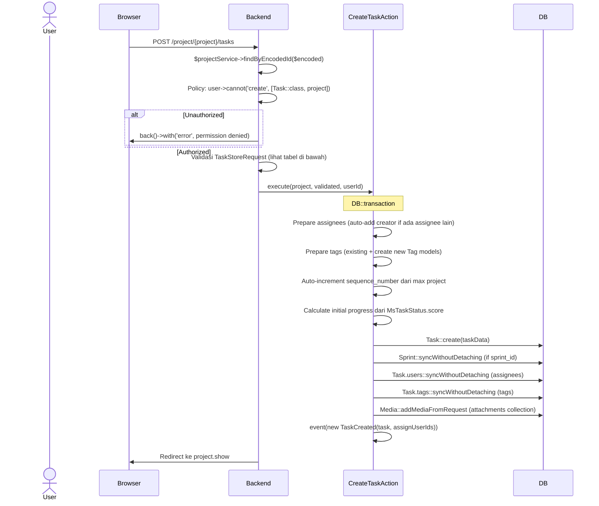
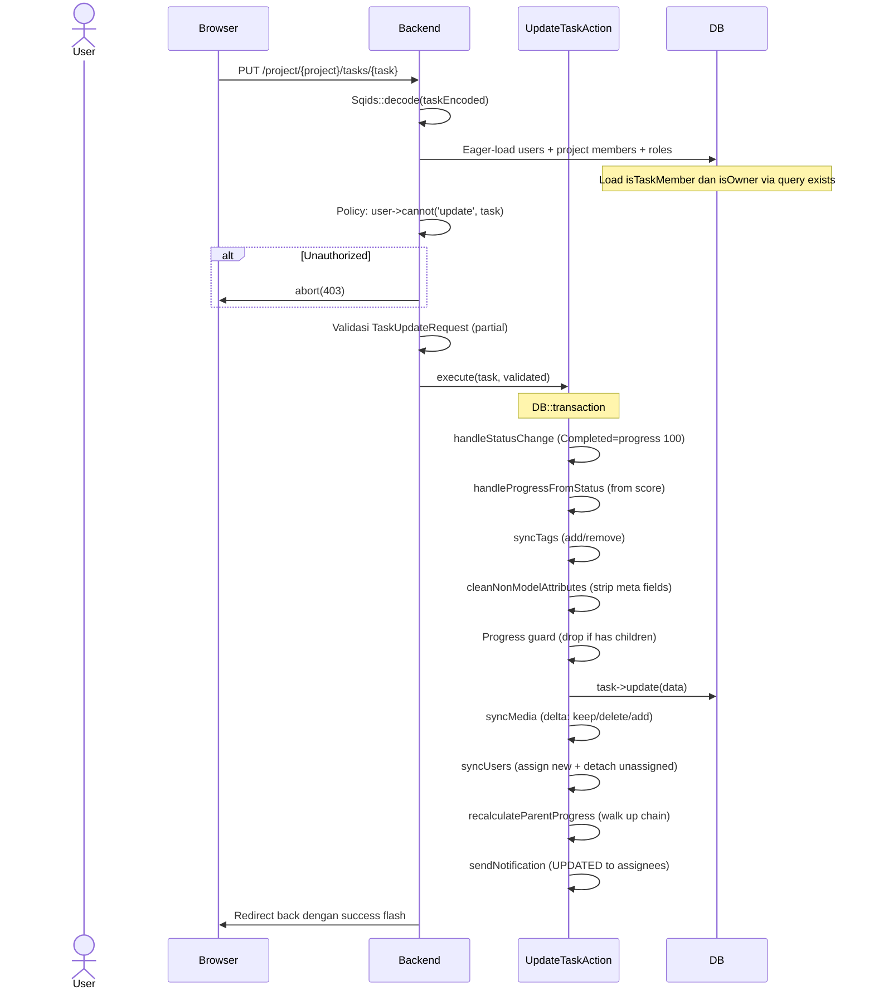
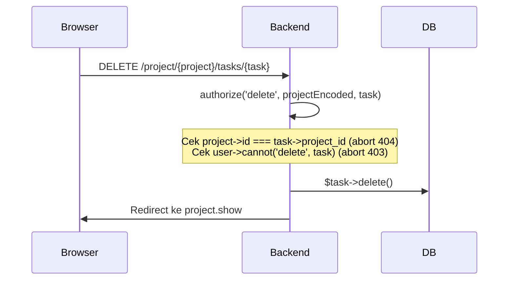
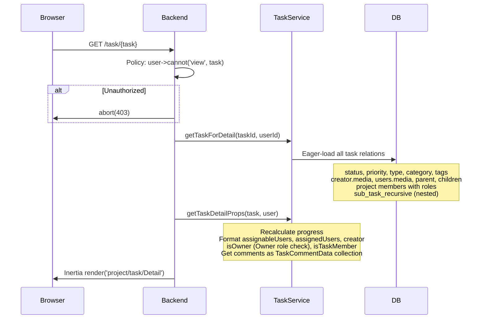
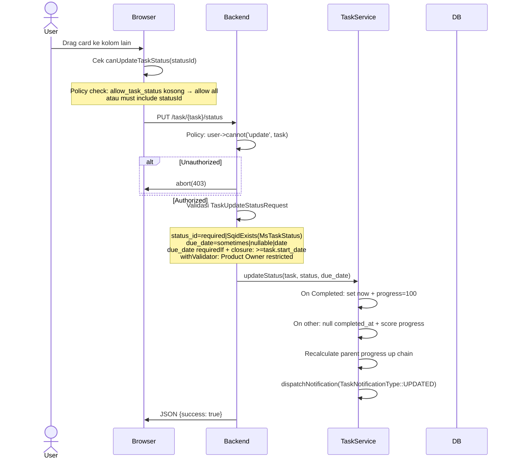
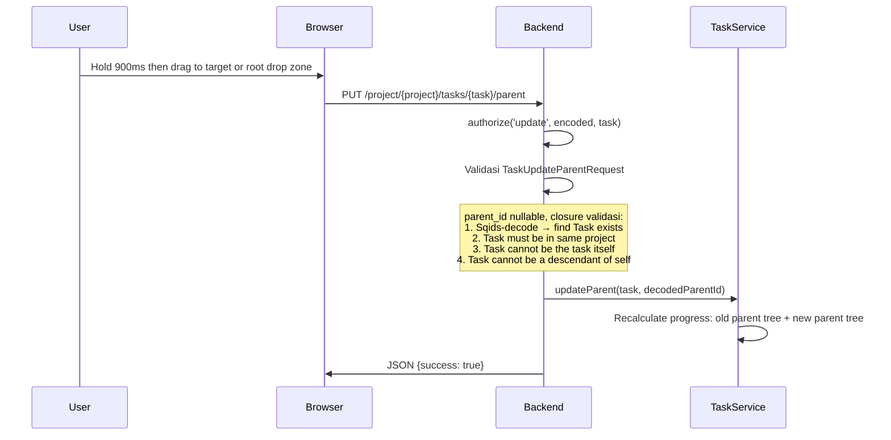
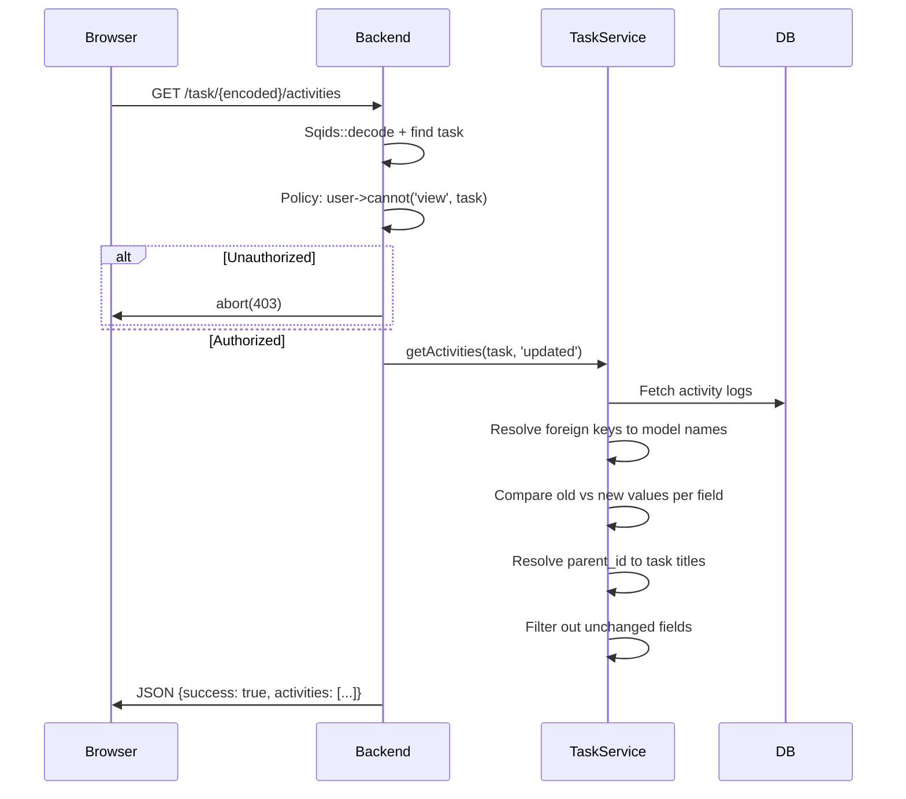
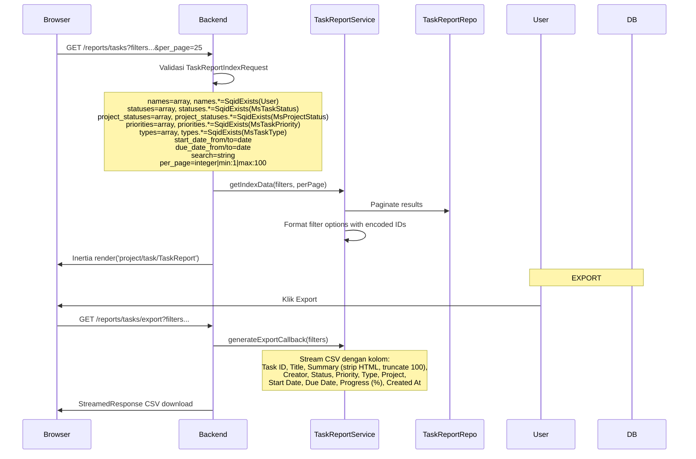

# Task Management

Manajemen task dalam project: CRUD, status/priority/parent update, aktivitas, detail view.

---

## 1. Create Task

### Flow Backend

### Validasi Lengkap (TaskStoreRequest)

| Field | Rule |
|-------|------|
| `project_id` | required (POST), exists:projects,id |
| `parent_id` | sometimes, nullable, exists:tasks,id |
| `status_id` | required, exists:ms_task_statuses,id |
| `priority_id` | required, exists:ms_task_priorities,id |
| `type_id` | required, exists:ms_task_types,id |
| `task_category_id` | nullable, exists:task_categories,id |
| `sprint_id` | nullable, exists:project_sprints,id |
| `owned_id` | sometimes, exists:users,id |
| `emoji` | nullable, string, max:100 |
| `title` | required, string, max:255 |
| `description` | nullable, string |
| `start_date` | Rule::requiredIf (status not "To Do"/"Blocked"), date |
| `due_date` | Rule::requiredIf (status not "To Do"/"Blocked"), date, after_or_equal:start_date |
| `sequence_number` | nullable, integer |
| `is_archived` | boolean |
| `assign_users` | nullable, array; each: exists:users,id |
| `unassign_users` | sometimes, array; each: exists:users,id |
| `add_tag.exists` | sometimes, array; each: exists:tags,id |
| `add_tag.new.*.name` | required_with:add_tag.new, string, max:255 |
| `add_tag.new.*.severity` | nullable, string, max:50 |
| `remove_tag` | sometimes, array; each: exists:tags,id |
| `attachments.*` | required, FileOrMedia (extensions gambar/video/doc, maxSize: 20MB) |

**prepareForValidation:** Sqids-decode `status_id`, `priority_id`, `type_id`, `task_category_id`, `sprint_id`, `project_id`, `owned_id`, `parent_id`, `assign_users`, `unassign_users`, `add_tag.exists`, `remove_tag`. Merge `progress` dari `progress_value`.

**withValidator:**
- In Progress status tanpa due_date → error
- Epic category tidak bisa punya parent → error

---

## 2. Update Task

### Flow Backend

### Validasi Lengkap (TaskUpdateRequest)

| Field | Rule |
|-------|------|
| `project_id` | sometimes, exists:projects,id |
| `parent_id` | sometimes, nullable, exists:tasks,id |
| `status_id` | required, exists:ms_task_statuses,id |
| `priority_id` | sometimes, nullable, exists:ms_task_priorities,id |
| `type_id` | sometimes, nullable, exists:ms_task_types,id |
| `task_category_id` | sometimes, nullable, exists:task_categories,id |
| `title` | sometimes, string, max:255 |
| `description` | sometimes, nullable, string |
| `start_date` | Rule::requiredIf (status not "To Do"/"Blocked"), date |
| `due_date` | Rule::requiredIf (status not "To Do"/"Blocked"), date, after_or_equal:start_date |
| `is_archived` | sometimes, boolean |
| `assign_users` | sometimes, array; each: exists:users,id |
| `unassign_users` | sometimes, array; each: exists:users,id |
| `add_tag.exists` | sometimes, array; each: exists:tags,id |
| `add_tag.new.*.name` | required_with, string, max:255 |
| `remove_tag` | sometimes, array; each: exists:tags,id |
| `attachments.*` | nullable, FileOrMedia |

**prepareForValidation:** Sqids-decode. Jika `status_id === 1` (To Do), set `due_date = null`. Merge progress dari `progress_value`.

**withValidator:** In Progress status wajib ada due_date (check existing di DB jika tidak di request).

---

## 3. Delete Task

---

## 4. Task Detail

### Flow Backend

### Frontend Detail (Detail.vue)

Layout 2 kolom:
- **Kiri:** TaskSubtasks + TaskDetails (inline editable) + TaskMembers
- **Kanan:** TaskDescription + TaskComments

**TaskDetails.vue - Inline Editing:**

Permission check sidebar:
- Developer role → hanya bisa lihat status "In Progress" dan "In Review"
- `!isTaskMember && !hasPermission() && !isOwner` → denied, tampilkan toast
- Jika `isTaskMember` atau `hasPermission()` atau `isOwner` → bisa edit

Inplace edit flow:
1. Klik field → `startEdit()` → masuk edit mode
2. `handleSelectChange()`: jika status "In Progress" + no due_date → emit `showInProgressDialog`
3. `autoSave(field, value)`: gunakan `useForm` + `form.put()` ke `project.tasks.update` route
4. Click outside / Escape → `cancelEdit()`
5. Progress bar otomatis (auto) jika task punya sub_task_recursive

---

## 5. Update Status (Kanban Drag-Drop)

### TaskUpdateStatusRequest Validation

| Field | Rule |
|-------|------|
| `status_id` | required, string, SqidExists(MsTaskStatus) |
| `due_date` | sometimes, nullable, date; requiredIf status not "To Do"/"Blocked" and task has no due_date; closure: >= task.start_date |

**withValidator:** Product Owner (role `product-owner-*`) hanya bisa set status ke "To Do", "Completed" (Complete), atau "Block" (Blocked).

---

## 6. Update Parent (Drag-Drop TreeTable)

### TaskUpdateParentRequest Validation

Semua validasi dalam satu closure pada field `parent_id`:
1. **Nullable.** Kalau null, tidak ada validasi lanjutan.
2. **Sqids-decode** + cek existence di `tasks` table.
3. **Same project:** parent `project_id` harus sama.
4. **Self check:** parent tidak boleh task itu sendiri.
5. **Ancestor check:** parent tidak boleh child/descendant dari task ini.

### TreeTable Frontend (Table.vue)

**Drag mechanics:**
- Hold 900ms (`DRAG_HOLD_MS`) untuk mengaktifkan drag mode
- `holdCandidateTaskId` → `holdTimerId` → validasi masih hover di row yang sama
- `autoExpandTargetKey` — auto-expand 500ms saat hover di atas parent
- Root drop zone: `pointerOnRootDropzone` = pointer di luar task row
- Filter disimpan per-user di sessionStorage (`task-table-filters-{userId}`)

**Action menu:**
- View Detail
- Add Subtask (emit add dengan parentId)
- Edit Task (emit edit)
- Delete (confirm + axios DELETE)
- Activity History (open modal → fetch `GET /task/{id}/activities`)

---

## 7. Task Activity

---

## 8. Task Report

### Flow

### Frontend (TaskReport.vue)

**Filters:**
- Assignee (MultiSelect dengan SqidExists)
- Project Status (MultiSelect)
- Task Status (MultiSelect)
- Priority (MultiSelect)
- Type (MultiSelect)
- Start Date / Due Date (DatePicker range)
- Search (input text)

**Pagination:** 10/25/50/100 per page, default 25.

---

## Routes

| Method | URI | Controller |
|--------|-----|------------|
| GET | `/task` | `TaskController@index` |
| GET | `/task/{task}` | `TaskController@show` |
| POST | `/project/{project}/tasks` | `TaskController@store` |
| PUT | `/project/{project}/tasks/{task}` | `TaskController@update` |
| DELETE | `/project/{project}/tasks/{task}` | `TaskController@destroy` |
| PUT | `/task/{task}/status` | `TaskController@updateStatus` |
| PUT | `/project/{project}/tasks/{task}/priority` | `TaskController@updatePriority` |
| PUT | `/project/{project}/tasks/{task}/parent` | `TaskController@updateParent` |
| PUT | `/task/{task}/parents` | `TaskController@update_parents` |
| GET | `/task/{task}/parents` | `TaskController@parents` |
| GET | `/task/{task}/comment` | `TaskController@comments` |
| GET | `/task/{encoded}/activities` | `TaskActivityController@index` |
| GET | `/reports/tasks` | `TaskReportController@index` |
| GET | `/reports/tasks/export` | `TaskReportController@export` |

## Frontend Files

| File | Purpose |
|------|---------|
| `pages/project/task/Detail.vue` | Detail 2 kolom: content (kiri) + description/comments (kanan) |
| `pages/project/task/Form.vue` | Drawer form (right, 50rem) dengan sub-components di `form-ui/` |
| `pages/project/task/Table.vue` | TreeTable List tab — hold 900ms drag reparent, filter sessionStorage |
| `pages/project/task/partials/TaskKanbanBoard.vue` | Kanban drag-drop columns (vue-draggable-plus) |
| `pages/project/task/partials/TaskDetails.vue` | Inline edit: status, priority, type, dates, progress |
| `pages/project/task/partials/TaskHeader.vue` | Breadcrumb + gradient card |
| `pages/project/task/partials/TaskComments.vue` | Comment thread + MentionEditor |
| `pages/project/task/partials/TaskInProgressDialog.vue` | Due date dialog |
| `pages/project/task/TaskReport.vue` | Report page dengan semua filter |
| `components/TaskActivityLogModal.vue` | Activity log modal |
| `components/Mentioneditor.vue` | Rich text editor dengan @mentions |
