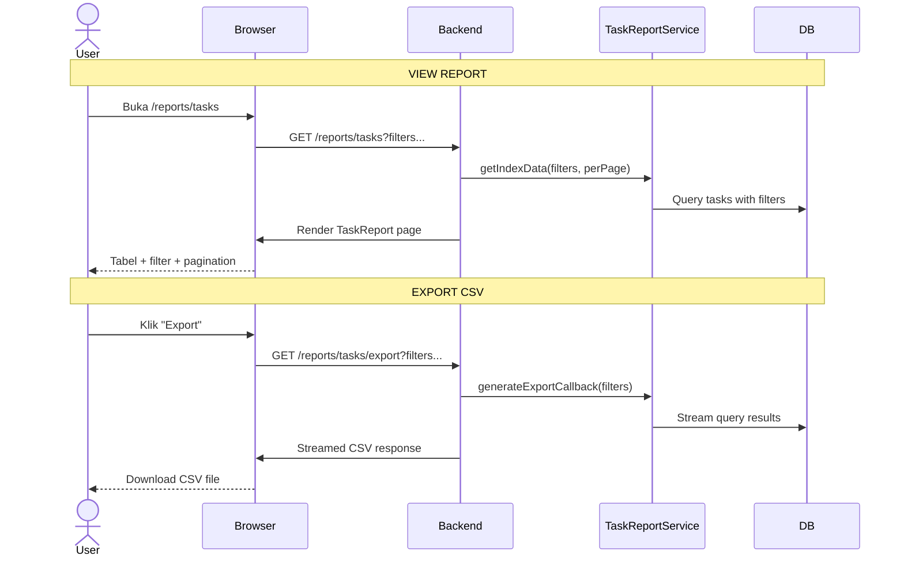

# Task Report

Laporan task lintas project dengan filter lanjutan dan export CSV.

## Flow

## Filters

- Assignee
- Project Status
- Task Status
- Priority
- Type
- Start Date Range
- Due Date Range
- Search text

## Routes

| Method | URI | Controller |
|--------|-----|------------|
| GET | `/reports/tasks` | `TaskReportController@index` |
| GET | `/reports/tasks/export` | `TaskReportController@export` |

## Frontend Pages

- `pages/project/task/TaskReport.vue` — Halaman report + filter
