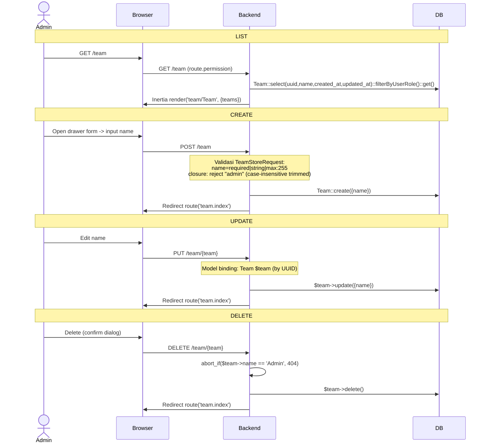

# Team Management

CRUD tim/departemen dengan constraint Admin team tidak bisa dihapus.

---

## Flow

## Validasi (TeamStoreRequest)

| Field | Rule |
|-------|------|
| `name` | required, string, max:255; closure: tidak boleh "admin" (case-insensitive, trimmed) |

## Routes

| Method | URI | Controller | Model Binding |
|--------|-----|------------|---------------|
| GET | `/team` | `TeamController@index` | — |
| POST | `/team` | `TeamController@store` | — |
| PUT | `/team/{team}` | `TeamController@update` | UUID |
| DELETE | `/team/{team}` | `TeamController@destroy` | UUID |

## Frontend

| File | Purpose |
|------|---------|
| `pages/team/Team.vue` | Halaman list |
| `pages/team/TeamListTable.vue` | DataTable dengan search, pagination, actions (edit/delete) |
| `pages/team/TeamForm.vue` | Drawer form (name input) |
