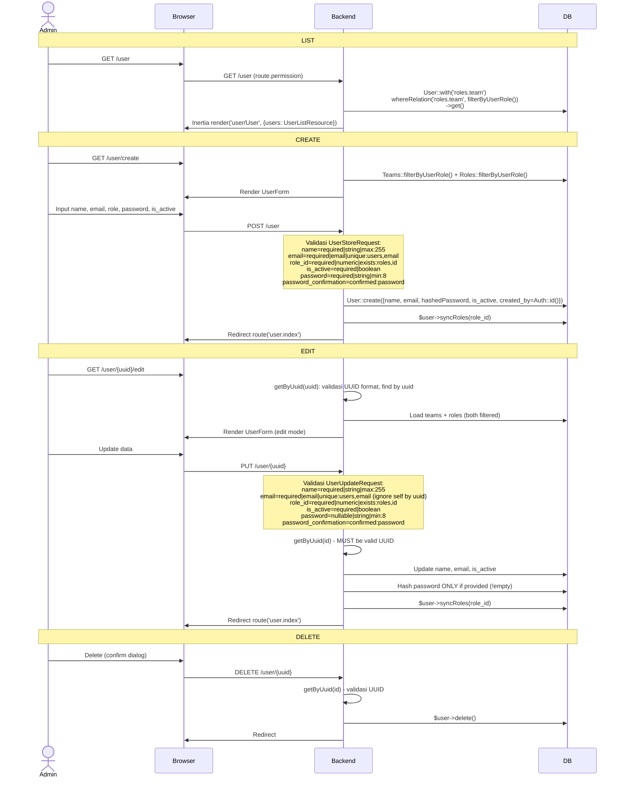

# User Management

CRUD pengguna dengan assignment role dan team, serta filter berbasis user role.

---

## Flow

## Validasi

### UserStoreRequest

| Field | Rule |
|-------|------|
| `name` | required, string, max:255 |
| `email` | required, email, unique:users,email |
| `role_id` | required, numeric, exists:roles,id |
| `is_active` | required, boolean |
| `password` | required, string, min:8 |
| `password_confirmation` | confirmed:password |

### UserUpdateRequest

| Field | Rule |
|-------|------|
| `name` | required, string, max:255 |
| `email` | required, email, unique:users,email (ignore by uuid, withoutTrashed) |
| `role_id` | required, numeric, exists:roles,id |
| `is_active` | required, boolean |
| `password` | nullable, string, min:8 (hanya di-hash jika diisi) |
| `password_confirmation` | confirmed:password |
| `avatar` | nullable, image, mimes:jpeg,jpg,png,gif, max:2048 |

## UUID Validation

Setiap akses user menggunakan UUID sebagai identifier (bukan integer). Method `getByUuid()`:
1. `Guid::isValid($uuid)` — validasi format UUID via Ramsey UUID library
2. `User::whereUuid($uuid)->firstOrFail()` — find by uuid column

## Routes

| Method | URI | Controller | Model Binding |
|--------|-----|------------|---------------|
| GET | `/user` | `UserController@index` | — |
| GET | `/user/create` | `UserController@create` | — |
| POST | `/user` | `UserController@store` | — |
| GET | `/user/{user}/edit` | `UserController@edit` | UUID |
| PUT | `/user/{user}` | `UserController@update` | UUID |
| DELETE | `/user/{user}` | `UserController@destroy` | UUID |

## Frontend

| File | Purpose |
|------|---------|
| `pages/user/User.vue` | Halaman list |
| `pages/user/UserForm.vue` | Form create/edit: Name, Email, Team (Select filtering), Role (dynamic based on team), Active Toggle, Password + confirmation |
| `pages/user/partials/UserTable.vue` | DataTable: No, Team, Role, Name, Email, Status, Created Date, Created By, Actions |
